## 📚 Theory 

By default, containers connect to a Linux bridge on the node where the container daemon (e.g. Docker, containerd) is running. To allow connectivity between those containers and any endpoint external to the node, port-mapping and/or NAT are required. Kubernetes networking model was conceived to simplify Docker container networking. 

Kubernetes introduces the concept of a Pod that allows multiple containers to share a single IP namespace and thus communicate over localhost. Every Pod communicates with other Pods in the cluster without NAT. Same goes for Kubelet on every node, it also communicates with every Pod in the cluster without having to use NAT. This is achieved by utilizing the Container Network Interface (CNI) model of plugins in Kubernetes. 

Red Hat OpenShift Networking relies on the Kubernetes CNI model. OpenShift supports various plugins by default, as well as several commercial SDN implementations including Cisco ACI. The CNI plugin to be used must be defined at installation time, typically in an Ansible playbook that kicks off the OpenShift installation process.

The Cisco ACI CNI Plugin for Red Hat OpenShift uses the acc-provision tool, which creates a tenant, a VMM Domain to keep the OpenShift cluster inventory in APIC and an Application Profile with an EPG for nodes and Pods that are used to allow the cluster connectivity. However, there are some ACI objects that need to be created prior to executing the acc-provision tool. These are:
- An attachable entity profile (AEP) set up with interfaces desired for the OpenShift deployment
- A Layer 3 Outside connection, along with a Layer 3 external network to serve as external access
- Virtual routing and forwarding (VRF) configured

The VRF and L3Out in Cisco ACI that are used to provide outside connectivity to OpenShift external services can be in any tenant. The most common usage is to put the VRF and L3Out in the common tenant or in a tenant that is dedicated to the OpenShift cluster. The subnet that is used for cluster external services has to be routed by the next-hop router that is connected to the selected ACI L3Out interface. This subnet is not announced by default, so either static routes or appropriate configuration must be considered. ACI fabric also must be configured with route reflectors.

For this session, the ACI prerequisites for the OpenShift installation have been already configured. 

Let's proceed.

## 💻 Practice

### 1. Log into the APIC with your credentials.


### 2. Verify that a VRF for your cluster exists in the common tenant.

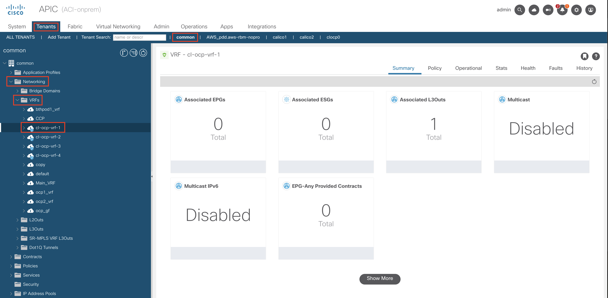

Go to Tenants > common > Networking > VRFs > cl-ocp-vrf-_YourPodNumber_

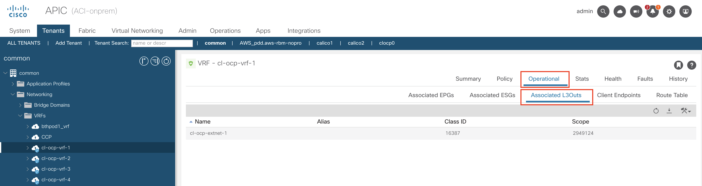

You can go through different tabs present in your VRF object, reviewing the policies in place. For example, in the Operational tab, under Associated L3Outs you can see that the L3Out that will be used to provide outside connectivity for your OpenShift cluster is associated with your VRF instance.


### 3. Verify that an L3Out for your cluster exists in the common tenant

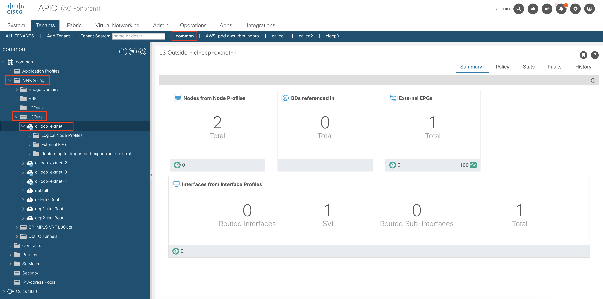

Go to Tenants > common > Networking > L3Outs > cl-ocp-extnet-_YourPodNumber_

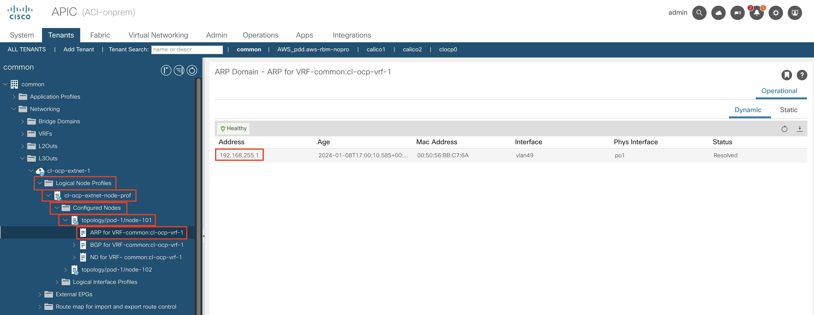

Similarly, you can go through the policies present for your L3Out instance. You can see for example that an ARP entry exists for your jumphost machine, under Logical Node Profiles > cl-ocp-extnet-node-prof > Configured Nodes > topology/pod-1/node-101 > ARP for VRF-common:cl-ocp-vrf-_YourPodNumber_


### 4. Log into your jumphost machine and verify that acc-provision is installed. Please refer to access details to find your jumphost IP address and credentials.

```
ssh cisco@172.18.0.31                                                                                                                                          
The authenticity of host '172.18.0.31 (172.18.0.31)' can't be established.
ED25519 key fingerprint is SHA256:YKLRJoY8n7TEPRUt+U2vigQ7WS6dcn73LXTxKUx4HT4.
This key is not known by any other names.
Are you sure you want to continue connecting (yes/no/[fingerprint])? yes
Warning: Permanently added '172.18.0.31' (ED25519) to the list of known hosts.
cisco@172.18.0.31's password:
Web console: https://jumphost-1.ciscolive.lab:9090/ or https://172.18.0.31:9090/

Last failed login: Thu Jan  4 09:16:17 CST 2024 from 192.168.101.94 on ssh:notty
There was 1 failed login attempt since the last successful login.
Last login: Tue Jan  2 14:31:44 2024 from 192.168.101.91
cisco@jumphost-1 ~ $
cisco@jumphost-1 ~ $ acc-provision --version
6.0.3.2
cisco@jumphost-1 ~ $
```


### 5. Modify the acc-provision input file in accordance with your lab section details. 

The acc-provision tool requires an input file in order to create necessary ACI objects for the integration with a OpenShift cluster. The input file can contain a lot of various configuration options. We will not cover all of these options in detail during this session due to time constraints. An input file has been prepared for you, you can find it in your home directory. Please modify it as follows:

```
cisco@jumphost-1 ~ $ cat acc-provision-input.yaml 
#
# Configuration for ACI Fabric
#
aci_config:
  system_id: clocpXX             # REPLACE XX WITH YOUR SETUP ID (01 - 20) e.g. clocp03
  apic_hosts:
  - 172.18.0.120
  vmm_domain:
    encap_type: vxlan
    mcast_range:
      start: 225.1.1.1
      end: 225.1.255.255
    nested_inside:
      installer_provisioned_lb_ip: 192.168.255.1

  aep: infra_aaep
  vrf:
    name: cl-ocp-vrf-XX          # REPLACE XX WITH YOUR SETUP ID (1 - 20) e.g. cl-ocp-vrf-03
    tenant: common
  l3out:
    name: cl-ocp-extnet-XX       # REPLACE XX WITH YOUR SETUP ID (1 - 20) e.g. cl-ocp-extnet-03
    external_networks:
    - cl-ocp-extnet-epg
#
# Networks used by ACI containers
#
net_config:
  node_subnet: 192.168.1.1/24
  pod_subnet:
  - 10.2.0.1/16
  extern_dynamic: 10.3.0.1/24
  extern_static: 10.4.0.1/24
  node_svc_subnet: 10.5.0.1/24
  kubeapi_vlan: 30xx            # INSERT VLAN HERE - setup1: 3001, setup2: 3002, ... ,setup20: 3020
  service_vlan: 30xx            # INSERT VLAN HERE - setup1: 3031, setup2: 3032, ... ,setup20: 3050
  infra_vlan: 3967
  kubeapi_vlan_mode: "regular"

multus:
  disable: false

registry:
  image_prefix: quay.io/noiro
  aci_containers_controller_version: 6.0.3.1.81c2369
  aci_containers_host_version: 6.0.3.1.81c2369
  cnideploy_version: 6.0.3.1.81c2369
  opflex_agent_version: 6.0.3.1.81c2369
  openvswitch_version: 6.0.3.1.81c2369
  snat_operator_version: 6.0.3.1.81c2369
  acc_provision_operator_version: 6.0.3.1.81c2369
  aci_containers_operator_version: 6.0.3.1.81c2369

kube_config:
  opflex_agent_statistics: False
```


### 6.	Run acc-provision against the APIC to configure OpenShift cluster logical constructs:

```
cisco@jumphost-1 ~ $ acc-provision -a -c acc-provision-input.yaml -f openshift-4.13-baremetal -u admin -p L1ons@svs -z aci_deployment.tar.gz
INFO: Loading configuration from "acc-provision-input.yaml"
INFO: Using configuration flavor openshift-4.13-baremetal
INFO: Generating certs for kubernetes controller
INFO:   Private key file: "user-clocp1.key"
INFO:   Certificate file: "user-clocp1.crt"

apiVersion: v1
kind: ServiceAccount
metadata:
  name: aci-containers-operator
  namespace: aci-containers-system
  labels:
    aci-containers-config-version: "8ab7cde0-53b3-4f03-bf8b-2f2857bac198"
---
apiVersion: rbac.authorization.k8s.io/v1
kind: ClusterRole
metadata:
  labels:
    aci-containers-config-version: "8ab7cde0-53b3-4f03-bf8b-2f2857bac198"
    network-plugin: aci-containers
  name: aci-containers-operator
rules:
- apiGroups:
  - apiextensions.k8s.io
  resources:
  - customresourcedefinitions
  verbs:
  - '*'
- apiGroups:
  - rbac.authorization.k8s.io
  resources:
  - clusterroles
  - clusterrolebindings
  verbs:
  - '*'
- apiGroups:
  - ''
  resources:
  - nodes
  - namespaces
  - configmaps
  - secrets
  - pods
  - services
  - serviceaccounts
  - serviceaccounts/token
  - endpoints
  - events
  - limitranges
  verbs:
  - '*'
- apiGroups:
  - networking.k8s.io
  resources:
  - networkpolicies
  verbs:
  - list
  - watch
  - get
- apiGroups:
  - "monitoring.coreos.com"
  resources:
  - servicemonitors
  verbs:
  - get
  - create
- apiGroups:
  - apps
  resources:
  - deployments
  - replicasets
  - daemonsets
  - statefulsets
  verbs:
  - '*'
- apiGroups:
  - aci.ctrl
  resources:
  - acicontainersoperators
  - acicontainersoperators/status
  - acicontainersoperators/finalizers
  verbs:
  - '*'
- apiGroups:
  - aci.ctrl
  resources:
  - accprovisioninputs
  - accprovisioninputs/status
  - accprovisioninputs/finalizers
  verbs:
  - '*'
- apiGroups:
  - scheduling.k8s.io
  resources:
  - '*'
  verbs:
  - '*'
- apiGroups:
  - aci.snat
  resources:
  - snatpolicies
  - snatglobalinfos
  - rdconfigs
  verbs:
  - list
  - watch
  - get
- apiGroups:
  - aci.snat
  resources:
  - nodeinfos
  verbs:
  - create
  - update
  - list
  - watch
  - get
- apiGroups:
  - config.openshift.io
  - operator.openshift.io
  resources:
  - '*'
  verbs:
  - '*'
- apiGroups:
  - route.openshift.io
  resources:
  - routes
  verbs:
  - create
  - update
  - list
  - watch
  - get
---
apiVersion: rbac.authorization.k8s.io/v1
kind: ClusterRoleBinding
metadata:
  name: aci-containers-operator
  labels:
    aci-containers-config-version: "8ab7cde0-53b3-4f03-bf8b-2f2857bac198"
roleRef:
  apiGroup: rbac.authorization.k8s.io
  kind: ClusterRole
  name: aci-containers-operator
subjects:
- kind: ServiceAccount
  name: aci-containers-operator
  namespace: aci-containers-system
---
apiVersion: apps/v1
kind: Deployment
metadata:
  name: aci-containers-operator
  namespace: aci-containers-system
  labels:
    aci-containers-config-version: "8ab7cde0-53b3-4f03-bf8b-2f2857bac198"
    name: aci-containers-operator
    network-plugin: aci-containers
spec:
  progressDeadlineSeconds: 600
  replicas: 1
  revisionHistoryLimit: 10
  selector:
    matchLabels:
      name: aci-containers-operator
      network-plugin: aci-containers
  strategy:
    type: Recreate
  template:
    metadata:
      name: aci-containers-operator
      namespace: aci-containers-system
      labels:
        name: aci-containers-operator
        network-plugin: aci-containers
    spec:
      affinity:
        nodeAffinity:
          preferredDuringSchedulingIgnoredDuringExecution:
          - preference:
              matchExpressions:
              - key: preferred-node
                operator: In
                values:
                - aci-containers-operator-2577247291
            weight: 1
      containers:
      - image: quay.io/noiro/aci-containers-operator:6.0.3.1.81c2369
        imagePullPolicy: Always
        name: aci-containers-operator
        terminationMessagePath: /dev/termination-log
        terminationMessagePolicy: File
        volumeMounts:
        - name: aci-operator-config
          mountPath: /usr/local/etc/aci-containers/
        - name: acc-provision-config
          mountPath: /usr/local/etc/acc-provision/
        - name: varlogpods
          mountPath: /var/log/pods
          readOnly: true
        - name: varlogcontainers
          mountPath: /var/log/containers
          readOnly: true
        - name: varlibdocker
          mountPath: /var/lib/docker
          readOnly: true
        env:
        - name: SYSTEM_NAMESPACE
          value: "aci-containers-system"
        - name: ACC_PROVISION_FLAVOR
          value: "openshift-4.13-baremetal"
        - name: OPERATOR_LOGGING_LEVEL
          value: "info"
      - env:
        - name: ANSIBLE_GATHERING
          value: explicit
        - name: WATCH_NAMESPACE
          valueFrom:
            fieldRef:
              fieldPath: metadata.namespace
        - name: ACC_PROVISION_FLAVOR
          value: "openshift-4.13-baremetal"
        - name: ACC_PROVISION_INPUT_CR_NAME
          value: "accprovisioninput"
        image: quay.io/noiro/acc-provision-operator:6.0.3.1.81c2369
        imagePullPolicy: Always
        name: acc-provision-operator
        terminationMessagePath: /dev/termination-log
        terminationMessagePolicy: File
      dnsPolicy: ClusterFirst
      hostNetwork: true
      restartPolicy: Always
      schedulerName: default-scheduler
      securityContext: {}
      serviceAccount: aci-containers-operator
      serviceAccountName: aci-containers-operator
      terminationGracePeriodSeconds: 30
      tolerations:
      - effect: NoSchedule
        operator: Exists
      volumes:
      - name: aci-operator-config
        configMap:
          name: aci-operator-config
          items:
          - key: spec
            path: aci-operator.conf
      - name: acc-provision-config
        configMap:
          name: acc-provision-config
          items:
          - key: spec
            path: acc-provision-operator.conf
      - name: varlogpods
        hostPath:
          path: /var/log/pods
      - name: varlogcontainers
        hostPath:
          path: /var/log/containers
      - name: varlibdocker
        hostPath:
          path: /var/lib/docker
INFO: Writing kubernetes infrastructure YAML to <stdout>
INFO: Writing ACI CNI operator tar to /dev/null
INFO: Apply infrastructure YAML using:
INFO:   oc apply -f <filename>
INFO: Delete stale objects from older deployments using:
INFO:   oc -n aci-containers-system delete configmap,secret,serviceaccount,daemonset,deployment,clusterrolebinding,clusterrole -l  'aci-containers-config-version,aci-containers-config-version notin (8ab7cde0-53b3-4f03-bf8b-2f2857bac198)'
INFO: Provisioning configuration in APIC
```


### 7. Verify execution of acc-provision by checking created objects on the APIC

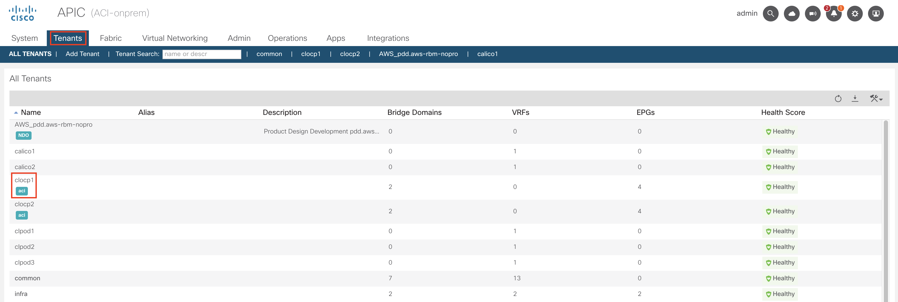
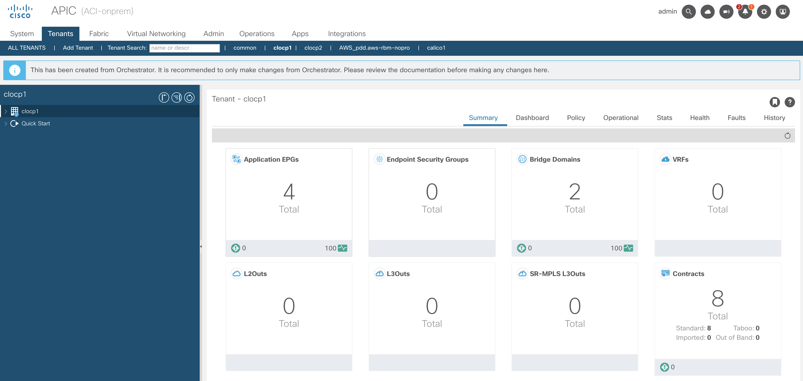

Go to Tenants > clocpXX (where XX stands for your pod number) to verify it's been created.

By default, the acc-provision tool creates a tenant with an Application Profile including EPGs for nodes and Pods that are used to allow the cluster connectivity, contracts allowing for external connectivity, a Service Graph instance for L4 load balancing (more on this in Section 2 of this lab guide), as well as a VMM Domain.

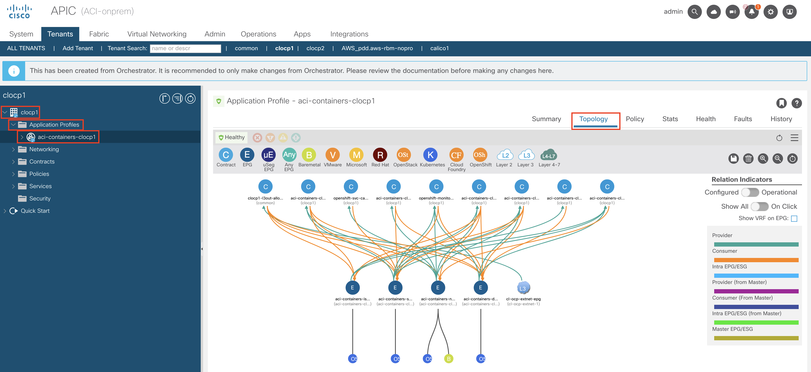

By going to Application Profiles > aci-containers-clocpXX (where XX stands for your pod number) and navigating to the Topology tab, you can see how the EPGs connect to one another, via which contracts. You can also see that the external connectivity for the cluster is established, using the L3Out created in the common tenant.

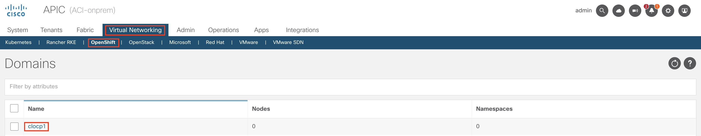
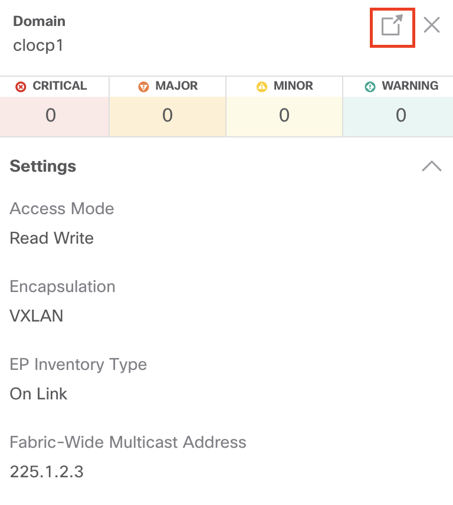
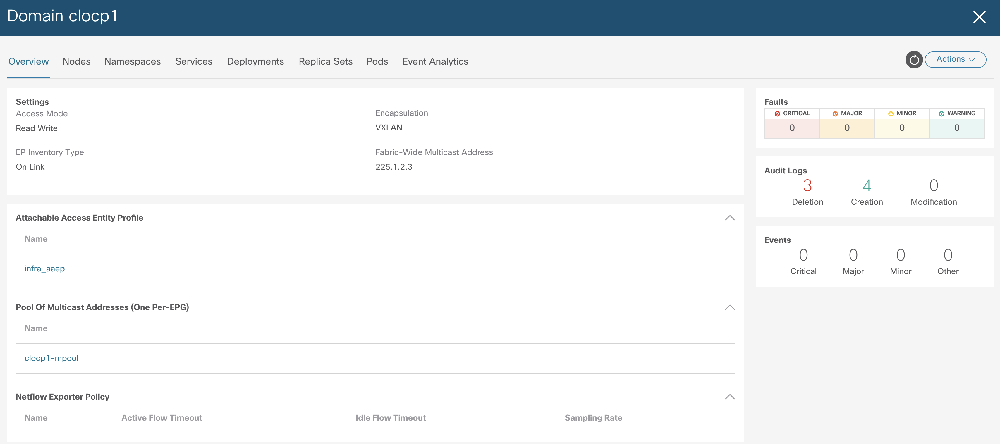

By going to Virtual Networking > OpenShift > clocpXX (where XX stands for your pod number), you can see that a VMM Domain for your cluster has been created. You can take your time to navigate through different tabs present here, for now you won't find any objects related to your container cluster (such as Pods or namespaces), cause you haven't installed OpenShift yet, but we will come back to this VMM Domain later on in this lab, after we install OpenShift and start deploying applications.

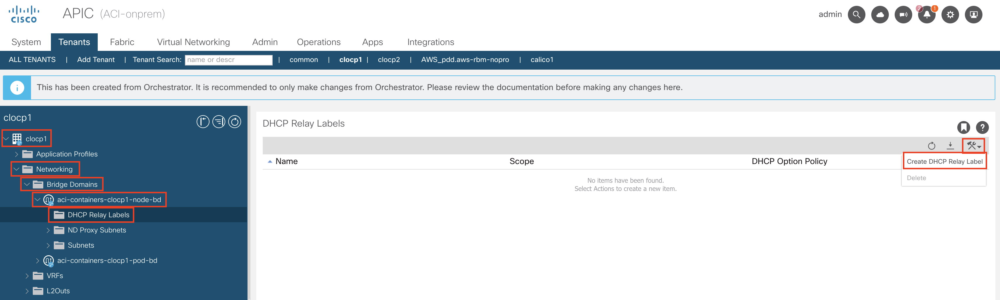


One last important thing in terms of networking on ACI that you will need to configure is to attach a DHCP relay policy to the node network Bridge Domain. We do that in order to assign IP addresses to our cluster nodes - the DHCP server is present on your jumphost machine, there ACI has to use a DHCP relay policy, pointing to the jumphost IP address. To add the policy, go to your tenant > Networking > Bridge Domains > aci-containers-clocpXX-node-bd > DHCP Relay Labels, then click on the tool icon, select Create DHCP Relay Label, and in the pop-up window select Scope infra and Name "setup-_YourPodNumber_-infra-dhcp-policy" and hit Submit.

That concludes Task 1 of Section 1. Please proceed to the next Task.