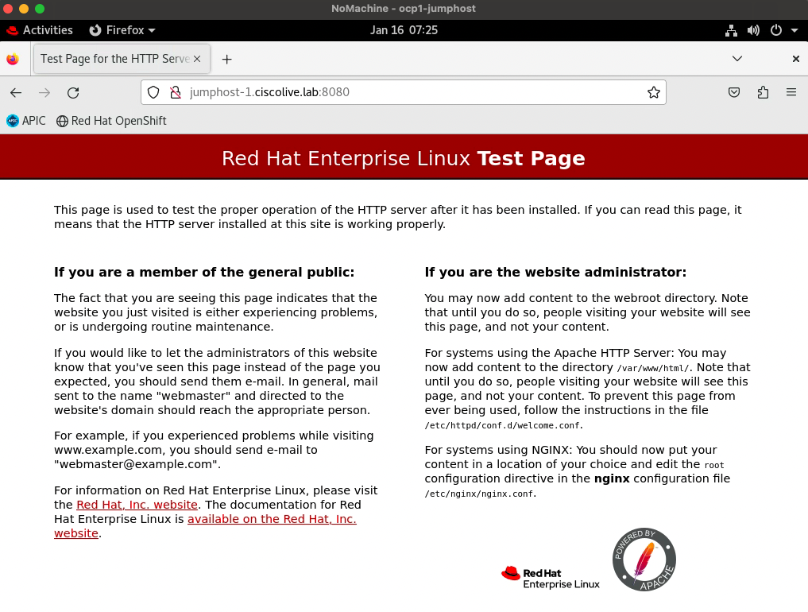
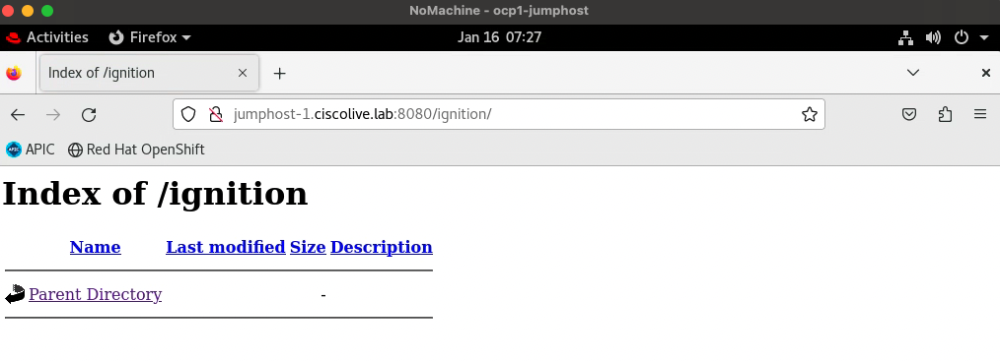
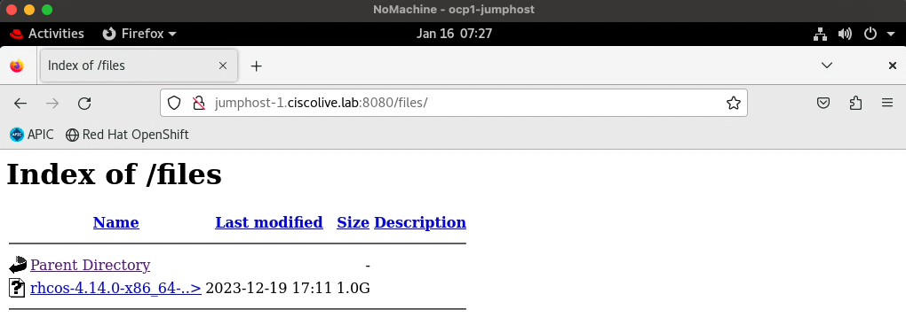

## 📚 Theory

We're all set on the networking side, now we need to set up files and services that will be necessary for the OpenShift installation.

For the installation procedure, OpenShift requires an installation program called openshift-install.

The openshift-install program is a Go binary file that performs a series of file transformations on a set of assets. The way you interact with the installation program differs depending on your installation type.

For the installation program, the program uses three sets of files during installation: an installation configuration file that is named install-config.yaml, Kubernetes manifests, and Ignition config files for your machine types. The installation configuration file is transformed into Kubernetes manifests, and then the manifests are wrapped into Ignition config files. The installation program uses these Ignition config files to create the cluster.

Another OpenShift tool that we will be using throughout this lab is OpenShift CLI (called oc in short). This tool allows to you to create applications and manage OpenShift Container Platform projects from a terminal. 

For the UPI installation method on bare metal infrastructure, you must install a special operating system called Red Hat Enterprise Linux CoreOS (RHCOS) on the cluster nodes. During RHCOS installation, the Ignition config file that will be generated by the openshift-install installation program must be provided. RHCOS installation can be done using either an ISO image or by network PXE booting. 

A PXE install requires an available DHCP service and more preparation, but can make the installation process more automated. An ISO install is a more manual process and can be inconvenient if you are setting up more than a few machines. In this lab, we will use PXE booting to install RHCOS on our cluster machines. For that, we must have the RHCOS images present on our jumphost machines. Other than the RHCOS images, OpenShift UPI installation also requires the presence of vmlinuz, which is the compressed, bootable Linux kernel image, as well as rootfs and initrd.

Besides that, since we will be installing OpenShift with the User-Provisoned Infrastructure method, we need to manage and maintain the cluster resources ourselves. The services that are required for the OpenShift installation are the DNS for the cluster and load balancing for the cluster. As mentioned when describing PXE booting, we will also need a DHCP server to assign the IP addresses and point to a TFTP server storing RHCOS images and ignition files for the installation of OpenShift.

Let's proceed.

## 💻 Practice 

### 1. Verify that the OpenShift installer is present on your jumphost machine

```
cisco@jumphost-1 ~ $ openshift-install version
openshift-install 4.13.27
built from commit 293f6a2fd4b7e8039f8163354409683ba7a072e2
release image quay.io/openshift-release-dev/ocp-release@sha256:bc9006f9160663663c6d9a735c4c497f8f3300d94a7ec45cdafef1cebb15ebfe
release architecture amd64
```


### 2. Verify that the OpenShift client is present on your jumphost machine

```
cisco@jumphost-1 ~ $ oc version
Client Version: 4.13.27
Kustomize Version: v4.5.7
```


### 3. Verify that the RHCOS image and vmlinuz is downloaded onto your jumphost machine

```
cisco@jumphost-1 ~ $ sudo ls -la /root/Downloads | grep "vmlinuz\|rhcos"
-rw-r--r--.  3 root root   91879968 10-31 12:55 rhcos-4.14.0-x86_64-live-initramfs.x86_64.img
-rw-r--r--.  1 root root 1042670592 10-31 12:55 rhcos-4.14.0-x86_64-live-rootfs.x86_64.img
-rw-r--r--.  3 root root   12204728 10-31 12:55 vmlinuz
```


### 4. Verify Cobbler service and DHCP configuration

Cobbler is a service that we're using to act as an automated way to manage DHCP for the PXE boot of the OpenShift cluster nodes. DHCP configuration in our environment is managed by Cobbler. You can read more on how to configure Cobbler for an OpenShift installation in the Appendix 1. You can also visit the Cobbler project homepage here https://cobbler.github.io/

```
cisco@jumphost-1 ~ $ sudo systemctl status cobblerd
● cobblerd.service - Cobbler Helper Daemon
   Loaded: loaded (/etc/systemd/system/cobblerd.service; enabled; vendor preset: disabled)
   Active: active (running) since Mon 2024-01-08 07:06:01 CST; 9h ago
 Main PID: 1126 (cobblerd)
    Tasks: 1 (limit: 23633)
   Memory: 78.2M
   CGroup: /system.slice/cobblerd.service
           └─1126 /usr/bin/python3 /usr/bin/cobblerd -F

jan 08 07:06:01 jumphost-1 systemd[1]: Started Cobbler Helper Daemon.
jan 08 07:06:05 jumphost-1 cobblerd[1126]: INFO | running: ['/usr/sbin/selinuxenabled']
jan 08 07:06:05 jumphost-1 cobblerd[1126]: INFO | received on stdout:
jan 08 07:06:06 jumphost-1 cobblerd[1126]: INFO | Automigration NOT executed
jan 08 07:06:06 jumphost-1 cobblerd[1126]: INFO | python3-hivex not found. If you need Automatic Windows Installation support, please install.
jan 08 07:06:11 jumphost-1 cobblerd[1126]: INFO | 11 breeds and 132 OS versions read from the signature file
jan 08 07:06:11 jumphost-1 cobblerd[1126]: INFO | Cobbler startup completed
```

```
cisco@jumphost-1 ~ $ cobbler system list
   cl-ocp1-bootstrap
   cl-ocp1-master1
   cl-ocp1-master2
   cl-ocp1-master3
```

```
cisco@jumphost-1 ~ $ cat /etc/cobbler/dhcp.template
# ******************************************************************
# Cobbler managed dhcpd.conf file
#
# generated from cobbler dhcp.conf template ($date)
# Do NOT make changes to /etc/dhcpd.conf. Instead, make your changes
# in /etc/cobbler/dhcp.template, as /etc/dhcpd.conf will be
# overwritten.
#
# ******************************************************************

ddns-update-style interim;

allow booting;
allow bootp;

ignore client-updates;
set vendorclass = option vendor-class-identifier;

option system-arch code 93 = unsigned integer 16;

subnet 192.168.255.0 netmask 255.255.255.0 {
}

subnet 192.168.1.0 netmask 255.255.255.0 {
     option routers             192.168.1.1;
     option domain-name-servers 192.168.255.1;
     option subnet-mask         255.255.255.0;
     # range dynamic-bootp        192.168.1.100 192.168.1.254;
     default-lease-time         21600;
     max-lease-time             43200;
     next-server                $next_server_v4;
     class "pxeclients" {
          match if substring (option vendor-class-identifier, 0, 9) = "PXEClient";

          # Legacy
          if option system-arch = 00:00 {
              filename "pxelinux.0";
          }
          # UEFI-32-1
          if option system-arch = 00:06 {
               # Not supported, no 32 bit UEFI grub executable
              filename "unsupported";
          }
          # UEFI-32-2
          if option system-arch = 00:02 {
              # Not supported, no 32 bit UEFI grub executable
              filename "unsupported";
          }
          # UEFI-64-1
          else if option system-arch = 00:07 {
              filename "grub/grubx64.efi";
          }
          # UEFI-64-2
          else if option system-arch = 00:08 {
              filename "grub/grubx64.efi";
          }
          # UEFI-64-3
          else if option system-arch = 00:09 {
              filename "grub/grubx64.efi";
          }
          # armv7   (aka arm 32 bit)
          else if option system-arch = 00:0a {
              filename "grub/armv7.efi";
          }
          # aarch64 (aka arm 64 bit)
          else if option system-arch = 00:0b {
              filename "grub/grubaa64.efi";
          }
          # RiskV 32 bit
          else if option system-arch = 00:25 {
              #ToDo petitboot loader
              # petitboot should support pxelinux config files
              filename "unsupported";
          }
          #RiskV 32 bit
          else if option system-arch = 00:27 {
              #ToDo petitboot loader
              # petitboot should support pxelinux config files
              filename "unsupported";
          }
          else if option system-arch = 00:0e {
              # FIXME add petitboot support for ppc64(le)
              filename "grub/grub.ppc64le";
          }
          else
          {
              filename "pxelinux.0";
          }
     }
}

#for dhcp_tag in $dhcp_tags.keys():
    ## group could be subnet if your dhcp tags line up with your subnets
    ## or really any valid dhcpd.conf construct ... if you only use the
    ## default dhcp tag in cobbler, the group block can be deleted for a
    ## flat configuration
# group for Cobbler DHCP tag: $dhcp_tag
group {
    #for mac in $dhcp_tags[$dhcp_tag].keys():
        #set iface = $dhcp_tags[$dhcp_tag][$mac]
    host $iface.name {
        #if $iface.interface_type == "infiniband":
            option dhcp-client-identifier = $mac;
        #else
            hardware ethernet $mac;
        #end if
        #if $iface.ip_address:
            fixed-address $iface.ip_address;
        #end if
        #if $iface.dns_name:
           option host-name "$iface.dns_name";
        #else if $iface.hostname:
            option host-name "$iface.hostname";
        #end if
        #if $iface.netmask:
            option subnet-mask $iface.netmask;
        #end if
        #if $iface.if_gateway:
            option routers $iface.if_gateway;
        #else if $iface.gateway:
            option routers $iface.gateway;
        #end if
        #if $iface.enable_ipxe:
            if exists user-class and option user-class = "iPXE" {
                filename "http://$cobbler_server/cblr/svc/op/ipxe/system/$iface.owner";
            } else {
                filename "undionly.kpxe";
            }
        #end if
        #if $iface.next_server_v4:
            next-server $iface.next_server_v4;
        #end if
        #if $iface.filename:
            filename "$iface.filename";
        #end if
        #if $iface.name_servers:
            #set $mynameservers = ','.join($iface.name_servers)
            option domain-name-servers $mynameservers;
        #end if
    }
    #end for
}
#end for
```

```
cisco@jumphost-1 ~ $ sudo systemctl status dhcpd
● dhcpd.service - DHCPv4 Server Daemon
   Loaded: loaded (/usr/lib/systemd/system/dhcpd.service; disabled; vendor preset: disabled)
   Active: inactive (dead)
     Docs: man:dhcpd(8)
           man:dhcpd.conf(5)
```

Notice that the dhcpd service is down at the moment - for it to start we have to run `cobbler sync` command. This command applies the Cobbler configuration changes and generates necessary files for DHCP based on the templates, as well as starts the dhcpd service.

When using DHCP to provide the IP networking configuration to your cluster nodes for OpenShift cluster installation, you have to add persistent IP addresses for the nodes to your DHCP server configuration and match the MAC addresses of the network interfaces to the intended IP addresses for each node. DNS server information also needs to be obtained by the nodes via DHCP.

You can also install an OpenShift Container Platform without using DHCP for IP networking configuration of the cluster nodes. In that case, the IP networking configuration and the address of the DNS server must be provided to the nodes at RHCOS install time, usually passed as boot arguments if installing from an ISO image.  

To confirm that the MAC addresses and IP addresses are assigned to the nodes in Cobbler, you can run the `cobbler system report --name <name of a node>` command. More on Cobbler configuration and commands in the Appendix 1.

```
cisco@jumphost-1 ~ $ cobbler system report --name cl-ocp1-master1
Name                           : cl-ocp1-master1
Automatic Installation Template : <<inherit>>
Automatic Installation Template Metadata : <<inherit>>
TFTP Boot Files                : <<inherit>>
Boot loaders                   : <<inherit>>
Comment                        :
Enable iPXE?                   : False
Fetchable Files                : <<inherit>>
DHCP Filename Override         : <<inherit>>
Gateway                        : 192.168.1.1
Hostname                       : master1
Image                          :
IPv6 Autoconfiguration         : False
IPv6 Default Device            :
Kernel Options                 : {'coreos.live.rootfs_url': 'http://192.168.255.1:8080/files/rhcos-4.14.0-x86_64-live-rootfs.x86_64.img', 'coreos.inst.install_dev': '/dev/sda', 'coreos.inst.ignition_url': 'http://192.168.255.1:8080/ignition/master.ign', 'ip': ['ens192:dhcp:9000', 'ens192:dhcp:9000', 'ens224.3967:dhcp:9000'], 'vlan': 'ens224.3967:ens224', 'rd.route': '224.0.0.0/4::ens224.3967'}
Kernel Options (Post Install)  : <<inherit>>
Management Classes             : <<inherit>>
Management Parameters          : <<inherit>>
Name Servers                   : []
Name Servers Search Path       : []
Netboot Enabled                : True
Next Server (IPv4) Override    : <<inherit>>
Next Server (IPv6) Override    : <<inherit>>
Owners                         : <<inherit>>
Power Management Address       :
Power Management ID            :
Power Identity File            :
Power Management Options       :
Power Management Password      :
Power Management Type          :
Power Management Username      :
Profile                        : rhcos-x86_64-4.14.0
Internal Proxy                 : <<inherit>>
Redhat Management Key          : <<inherit>>
Repos Enabled                  : False
Serial Baud Rate               : -1
Serial Device #                : -1
Server Override                : <<inherit>>
Status                         :
Template Files                 : {}
Virt Auto Boot                 : <<inherit>>
Virt CPUs                      : 0
Virt Disk Driver Type          : <<inherit>>
Virt File Size(GB)             : <<inherit>>
Virt Path                      : <<inherit>>
Virt PXE Boot                  : False
Virt RAM (MB)                  : <<inherit>>
Virt Type                      : <<inherit>>
Interface =====                : default
Bonding Opts                   :
Bridge Opts                    :
CNAMES                         : []
InfiniBand Connected Mode      : False
DHCP Tag                       :
DNS Name                       : master1.ciscolive.lab
Per-Interface Gateway          :
Master Interface               :
Interface Type                 : na
IP Address                     : 192.168.1.3
IPv6 Address                   :
IPv6 Default Gateway           :
IPv6 MTU                       :
IPv6 Prefix                    :
IPv6 Secondaries               : []
IPv6 Static Routes             : []
MAC Address                    : 00:50:56:00:01:01
Management Interface           : False
MTU                            :
Subnet Mask                    : 255.255.255.0
Static                         : False
Static Routes                  : []
Virt Bridge                    : <<inherit>>
```


### 5. Run the `cobbler sync` command and check whether DHCP service is running.

```
cisco@jumphost-1 ~ $ cobbler sync
task started: 2024-01-12_044816_sync
task started (id=Sync, time=Fri Jan 12 04:48:16 2024)
syncing all
running pre-sync triggers
cleaning trees
removing: /var/lib/tftpboot/grub/images
copying bootloaders
running: ['rsync', '-rpt', '--copy-links', '--exclude=.cobbler_postun_cleanup', '/var/lib/cobbler/loaders/', '/var/lib/tftpboot']
received on stdout:
running: ['rsync', '-rpt', '--copy-links', '--exclude=README.grubconfig', '/var/lib/cobbler/grub_config/', '/var/lib/tftpboot']
received on stdout:
copying distros to tftpboot
copying files for distro: rhcos-x86_64-4.14.0
trying hardlink /root/Downloads/vmlinuz -> /var/lib/tftpboot/images/rhcos-x86_64-4.14.0/vmlinuz
trying hardlink /root/Downloads/rhcos-4.14.0-x86_64-live-initramfs.x86_64.img -> /var/lib/tftpboot/images/rhcos-x86_64-4.14.0/rhcos-4.14.0-x86_64-live-initramfs.x86_64.img
copying images
generating PXE configuration files
generating: /var/lib/tftpboot/pxelinux.cfg/01-00-50-56-00-01-00
generating: /var/lib/tftpboot/grub/system/00:50:56:00:01:00
generating: /var/lib/tftpboot/pxelinux.cfg/01-00-50-56-00-01-01
generating: /var/lib/tftpboot/grub/system/00:50:56:00:01:01
generating: /var/lib/tftpboot/pxelinux.cfg/01-00-50-56-00-01-02
generating: /var/lib/tftpboot/grub/system/00:50:56:00:01:02
generating: /var/lib/tftpboot/pxelinux.cfg/01-00-50-56-00-01-03
generating: /var/lib/tftpboot/grub/system/00:50:56:00:01:03
generating PXE menu structure
copying files for distro: rhcos-x86_64-4.14.0
trying hardlink /root/Downloads/vmlinuz -> /var/www/cobbler/images/rhcos-x86_64-4.14.0/vmlinuz
trying hardlink /root/Downloads/rhcos-4.14.0-x86_64-live-initramfs.x86_64.img -> /var/www/cobbler/images/rhcos-x86_64-4.14.0/rhcos-4.14.0-x86_64-live-initramfs.x86_64.img
Writing template files for rhcos-x86_64-4.14.0
rendering DHCP files
generating /etc/dhcp/dhcpd.conf
processing boot_files for distro: rhcos-x86_64-4.14.0
cleaning link caches
running post-sync triggers
running: ['dhcpd', '-t', '-q']
received on stdout:
running: ['systemctl', 'restart', 'dhcpd']
received on stdout:
*** TASK COMPLETE ***
```

```
cisco@jumphost-1 ~ $ sudo systemctl status dhcpd
● dhcpd.service - DHCPv4 Server Daemon
   Loaded: loaded (/usr/lib/systemd/system/dhcpd.service; disabled; vendor preset: disabled)
   Active: active (running) since Fri 2024-01-12 04:48:18 CST; 12s ago
     Docs: man:dhcpd(8)
           man:dhcpd.conf(5)
 Main PID: 180366 (dhcpd)
   Status: "Dispatching packets..."
    Tasks: 1 (limit: 23633)
   Memory: 7.8M
   CGroup: /system.slice/dhcpd.service
           └─180366 /usr/sbin/dhcpd -f -cf /etc/dhcp/dhcpd.conf -user dhcpd -group dhcpd --no-pid

jan 12 04:48:18 jumphost-1 dhcpd[180366]:
jan 12 04:48:18 jumphost-1 dhcpd[180366]: No subnet declaration for ens192 (172.18.0.31).
jan 12 04:48:18 jumphost-1 dhcpd[180366]: ** Ignoring requests on ens192.  If this is not what
jan 12 04:48:18 jumphost-1 dhcpd[180366]:    you want, please write a subnet declaration
jan 12 04:48:18 jumphost-1 dhcpd[180366]:    in your dhcpd.conf file for the network segment
jan 12 04:48:18 jumphost-1 dhcpd[180366]:    to which interface ens192 is attached. **
jan 12 04:48:18 jumphost-1 dhcpd[180366]:
jan 12 04:48:18 jumphost-1 dhcpd[180366]: Sending on   Socket/fallback/fallback-net
jan 12 04:48:18 jumphost-1 dhcpd[180366]: Server starting service.
jan 12 04:48:18 jumphost-1 systemd[1]: Started DHCPv4 Server Daemon.
```

```
cisco@jumphost-1 ~ $ sudo cat /etc/dhcp/dhcpd.conf
# ******************************************************************
# Cobbler managed dhcpd.conf file
# generated from cobbler dhcp.conf template (Thu Jan  4 15:22:45 2024)
# Do NOT make changes to /etc/dhcpd.conf. Instead, make your changes
# in /etc/cobbler/dhcp.template, as /etc/dhcpd.conf will be
# overwritten.
# ******************************************************************

ddns-update-style interim;

allow booting;
allow bootp;

ignore client-updates;
set vendorclass = option vendor-class-identifier;

option system-arch code 93 = unsigned integer 16;

subnet 192.168.255.0 netmask 255.255.255.0 {
}

subnet 192.168.1.0 netmask 255.255.255.0 {
     option routers             192.168.1.1;
     option domain-name-servers 192.168.255.1;
     option subnet-mask         255.255.255.0;
     # range dynamic-bootp        192.168.1.100 192.168.1.254;
     default-lease-time         21600;
     max-lease-time             43200;
     next-server                192.168.255.1;
     class "pxeclients" {
          match if substring (option vendor-class-identifier, 0, 9) = "PXEClient";

          # Legacy
          if option system-arch = 00:00 {
              filename "pxelinux.0";
          }
          # UEFI-32-1
          if option system-arch = 00:06 {
               # Not supported, no 32 bit UEFI grub executable
              filename "unsupported";
          }
          # UEFI-32-2
          if option system-arch = 00:02 {
              # Not supported, no 32 bit UEFI grub executable
              filename "unsupported";
          }
          # UEFI-64-1
          else if option system-arch = 00:07 {
              filename "grub/grubx64.efi";
          }
          # UEFI-64-2
          else if option system-arch = 00:08 {
              filename "grub/grubx64.efi";
          }
          # UEFI-64-3
          else if option system-arch = 00:09 {
              filename "grub/grubx64.efi";
          }
          # armv7   (aka arm 32 bit)
          else if option system-arch = 00:0a {
              filename "grub/armv7.efi";
          }
          # aarch64 (aka arm 64 bit)
          else if option system-arch = 00:0b {
              filename "grub/grubaa64.efi";
          }
          # RiskV 32 bit
          else if option system-arch = 00:25 {
              #ToDo petitboot loader
              # petitboot should support pxelinux config files
              filename "unsupported";
          }
          #RiskV 32 bit
          else if option system-arch = 00:27 {
              #ToDo petitboot loader
              # petitboot should support pxelinux config files
              filename "unsupported";
          }
          else if option system-arch = 00:0e {
              # FIXME add petitboot support for ppc64(le)
              filename "grub/grub.ppc64le";
          }
          else
          {
              filename "pxelinux.0";
          }
     }
}

# group for Cobbler DHCP tag: default
group {
    host bootstrap.ciscolive.lab-default {
            hardware ethernet 00:50:56:00:01:00;
            fixed-address 192.168.1.8;
           option host-name "bootstrap.ciscolive.lab";
            option subnet-mask 255.255.255.0;
            option routers 192.168.1.1;
            next-server 192.168.255.1;
    }
    host master1.ciscolive.lab-default {
            hardware ethernet 00:50:56:00:01:01;
            fixed-address 192.168.1.3;
           option host-name "master1.ciscolive.lab";
            option subnet-mask 255.255.255.0;
            option routers 192.168.1.1;
            next-server 192.168.255.1;
    }
    host master2.ciscolive.lab-default {
            hardware ethernet 00:50:56:00:01:02;
            fixed-address 192.168.1.4;
           option host-name "master2.ciscolive.lab";
            option subnet-mask 255.255.255.0;
            option routers 192.168.1.1;
            next-server 192.168.255.1;
    }
    host master3.ciscolive.lab-default {
            hardware ethernet 00:50:56:00:01:03;
            fixed-address 192.168.1.5;
           option host-name "master3.ciscolive.lab";
            option subnet-mask 255.255.255.0;
            option routers 192.168.1.1;
            next-server 192.168.255.1;
    }
}
```

Notice that the dhcpd service is now up and running, with the DHCP configuration files generated based on the Cobbler DHCP template, therefore your jumphost machine is now operationally acting as a DHCP server, which will be used by the OpenShift nodes during the installation.

Cobbler has also generated the PXE configuration files necessary for PXE boot and linked the pre-downloaded images for RHCOS to the /var/www/cobbler directory.


### 6. Check the /var/www/cobbler directory to confirm that the RHCOS image is present in order to boot the OpenShift nodes.

```
cisco@jumphost-1 ~ $ ls -la /var/www/cobbler
total 0
drwxr-xr-x. 11 root root 142 12-19 09:48 .
drwxr-xr-x.  5 root root  48 12-19 09:53 ..
drwxr-xr-x.  3 root root  20 12-19 09:48 distro_mirror
drwxr-xr-x.  3 root root  33 01-12 04:48 images
drwxr-xr-x.  2 root root   6 12-19 09:48 links
drwxr-xr-x.  2 root root   6 12-19 09:48 localmirror
drwxr-xr-x.  2 root root  39 12-19 09:48 misc
drwxr-xr-x.  2 root root   6 12-19 09:48 pub
drwxr-xr-x.  2 root root   6 12-19 09:48 rendered
drwxr-xr-x.  2 root root   6 12-19 09:48 repo_mirror
drwxr-xr-x.  2 root root  25 12-19 09:48 svc
cisco@jumphost-1 ~ $
cisco@jumphost-1 ~ $ ls -la /var/www/cobbler/images
total 0
drwxr-xr-x.  3 root root  33 01-12 04:48 .
drwxr-xr-x. 11 root root 142 12-19 09:48 ..
drwxr-xr-x   2 root root  74 01-12 04:48 rhcos-x86_64-4.14.0
cisco@jumphost-1 ~ $
cisco@jumphost-1 ~ $ ls -la /var/www/cobbler/images/rhcos-x86_64-4.14.0/
total 101648
drwxr-xr-x  2 root root       74 01-12 04:48 .
drwxr-xr-x. 3 root root       33 01-12 04:48 ..
-rw-r--r--. 3 root root 91879968 10-31 12:55 rhcos-4.14.0-x86_64-live-initramfs.x86_64.img
-rw-r--r--. 3 root root 12204728 10-31 12:55 vmlinuz
```


### 7. Check the /var/lib/tftpboot directory and notice the PXE configuration files generated by Cobbler.

```
cisco@jumphost-1 ~ $ ls -la /var/lib/tftpboot/
total 168
drwxr-xr-x. 11 root root    179 12-19 09:48 .
drwxr-xr-x. 71 root root   4096 01-02 03:43 ..
drwxr-xr-x.  2 root root      6 12-19 09:48 boot
drwxr-xr-x.  2 root root      6 12-19 09:48 etc
drwxr-xr-x.  4 root root    177 01-12 04:48 grub
-rw-r--r--.  1 root root    429 12-19 09:42 grub.cfg
drwxr-xr-x.  4 root root     52 01-12 04:48 images
drwxr-xr-x.  2 root root      6 12-19 09:48 images2
drwxr-xr-x.  2 root root     26 01-12 04:48 ipxe
-rw-r--r--.  1 root root 116064 12-20 10:11 ldlinux.c32
drwxr-xr-x.  2 root root      6 12-19 09:48 ppc
-rw-r--r--.  1 root root  42376 12-19 10:36 pxelinux.0
drwxr-xr-x.  2 root root    189 01-12 04:48 pxelinux.cfg
drwxr-xr-x.  2 root root      6 12-19 09:48 s390x
cisco@jumphost-1 ~ $
cisco@jumphost-1 ~ $ ls -la /var/lib/tftpboot/pxelinux.cfg/
total 28
drwxr-xr-x.  2 root root 189 01-12 04:48 .
drwxr-xr-x. 11 root root 179 12-19 09:48 ..
-rw-r--r--   1 root root 498 01-12 04:48 01-00-50-56-00-01-00
-rw-r--r--   1 root root 590 01-12 04:48 01-00-50-56-00-01-01
-rw-r--r--   1 root root 590 01-12 04:48 01-00-50-56-00-01-02
-rw-r--r--   1 root root 590 01-12 04:48 01-00-50-56-00-01-03
-rw-r--r--   1 root root 411 01-12 04:48 default
```

Notice that the PXE configuration files are generated by Cobbler following a naming convention of nodes' MAC addresses.

```
cisco@jumphost-1 ~ $ cat /var/lib/tftpboot/pxelinux.cfg/01-00-50-56-00-01-00
timeout 1
prompt 0
default cl-ocp1-bootstrap
ontimeout cl-ocp1-bootstrap
LABEL cl-ocp1-bootstrap
	MENU LABEL cl-ocp1-bootstrap
	kernel /images/rhcos-x86_64-4.14.0/vmlinuz
	append initrd=/images/rhcos-x86_64-4.14.0/rhcos-4.14.0-x86_64-live-initramfs.x86_64.img coreos.live.rootfs_url=http://192.168.255.1:8080/files/rhcos-4.14.0-x86_64-live-rootfs.x86_64.img coreos.inst.install_dev=/dev/sda coreos.inst.ignition_url=http://192.168.255.1:8080/ignition/bootstrap.ign ip=ens192:dhcp:9000
	ipappend 2
```

RHCOS can be configured during installation by using kernel arguments. For example, you can specify the locations of the RHCOS installation files that you uploaded to your HTTP server and the location of the Ignition config file for the type of node you are installing. For a PXE installation, as is it case in our lab, you can use the APPEND parameter to pass the arguments to the kernel of the live installer. For an ISO installation, you can interrupt the live installation boot process to add the kernel arguments.

The above is the PXE configuration file for the bootstrap machine. Especially important is the `append initrd` line, where we specify as kernel arguments the URLs from which the nodes should download the RHCOS image and the ignition file that will be generated during the installation. IP addressing is also specified, telling the bootstrap machine to grab the IP address from DHCP.

```
cisco@jumphost-1 ~ $ cat /var/lib/tftpboot/pxelinux.cfg/01-00-50-56-00-01-01
timeout 1
prompt 0
default cl-ocp1-master1
ontimeout cl-ocp1-master1
LABEL cl-ocp1-master1
	MENU LABEL cl-ocp1-master1
	kernel /images/rhcos-x86_64-4.14.0/vmlinuz
	append initrd=/images/rhcos-x86_64-4.14.0/rhcos-4.14.0-x86_64-live-initramfs.x86_64.img coreos.live.rootfs_url=http://192.168.255.1:8080/files/rhcos-4.14.0-x86_64-live-rootfs.x86_64.img coreos.inst.install_dev=/dev/sda coreos.inst.ignition_url=http://192.168.255.1:8080/ignition/master.ign ip=ens192:dhcp:9000 ip=ens192:dhcp:9000 ip=ens224.3967:dhcp:9000 vlan=ens224.3967:ens224 rd.route=224.0.0.0/4::ens224.3967
	ipappend 2
```

The above is the PXE configuration file for the master node. Besides the RHCOS image URL and the ignition file URL, you can notice that we also configure a subinterface in the ACI infra VLAN of 3967, with a route for multicast address pool.


### 8. Verify the DNS configuration and check whether DNS service is running on your jumphost machine.

In OpenShift Container Platform deployments, DNS name resolution is required for the Kubernetes API, the OpenShift Container Platform application wildcard and the bootstrap, control plane, and compute machines. Reverse DNS is needed as well, for the Kubernetes API, the bootstrap machine, the control plane machines, and the compute machines.

DNS A/AAAA or CNAME records are used for name resolution and PTR records are used for reverse name resolution. The reverse records are important because RHCOS uses the reverse records to set the hostnames for all the nodes, unless the hostnames are provided by DHCP. Additionally, the reverse records are used to generate the certificate signing requests (CSR) that OpenShift Container Platform needs to operate. 

The following DNS records are required for a user-provisioned OpenShift Container Platform cluster and they must be in place before installation:
 - Kubernetes API - api.<cluster_name>.<base_domain> - A/AAAA or CNAME record and PTR record - to identify the API load balancer, must be resolvable by both clients external to the cluster and from all the nodes within the cluster. 
 - Kubernetes API - api-int.<cluster_name>.<base_domain> - A/AAAA or CNAME record and PTR record - to internally identify the API load balancer, must be resolvable from all the nodes within the cluster. 
 - Routes - *.apps.<cluster_name>.<base_domain> - wildcard A/AAAA or CNAME record - to refer to the application ingress load balancer. The application ingress load balancer targets the machines that run the Ingress Controller pods. Records must be resolvable by both clients external to the cluster and from all the nodes within the cluster. 
 - Bootstrap node - bootstrap.<cluster_name>.<base_domain> - A/AAAA or CNAME record and PTR record - to identify the bootstrap machine, must be resolvable by the nodes within the cluster. 
 - Master nodes - <master_hostname>.<cluster_name>.<base_domain> - A/AAAA or CNAME record and PTR record - to identify each machine for the control plane nodes, must be resolvable by the nodes within the cluster. 
 - Worker nodes - <worker_hostname>.<cluster_name>.<base_domain> - A/AAAA or CNAME record and PTR record - to identify each machine for the worker nodes, must be resolvable by the nodes within the cluster. 

In each record, <cluster_name> is the cluster name and <base_domain> is the base domain that you specify in the install-config.yaml file. A complete DNS record takes the form: <component>.<cluster_name>.<base_domain>.

Other than that, for each control plane machine, OpenShift requires DNS records etcd-<id>.<cluster_name>.<base_domain> to point to control plane machines. The DNS record must resolve to an unicast IPv4 address for the control plane machine and the records must be resolvable from all the nodes in the cluster.


```
cisco@jumphost-1 ~ $ sudo cat /etc/named.conf
options {
    listen-on port 53 { 192.168.255.1; any; };
    listen-on-v6 port 53 { ::1; };
    directory     "/var/named";
    dump-file     "/var/named/data/cache_dump.db";
    statistics-file "/var/named/data/named_stats.txt";
    memstatistics-file "/var/named/data/named_mem_stats.txt";
    allow-query     { localhost;  192.168.1.0/24; any;};
    recursion True;

    dnssec-enable no;
    dnssec-validation no;
    dnssec-lookaside no;

    /* Path to ISC DLV key */
    bindkeys-file "/etc/named.iscdlv.key";

    managed-keys-directory "/var/named/dynamic";

    forward first;
    forwarders {
      172.18.0.10;
    };

};

logging {
        channel default_debug {
                file "data/named.run";
                severity dynamic;
        };
};


zone "ocp.ciscolive.lab." IN {
   type master;
   file "ocp.ciscolive.lab.forward";
};

zone "1.168.192.in-addr.arpa" {
   type master;
   file "1.168.192.in-addr.arpa";
};


zone "." IN {
    type hint;
    file "named.ca";
};

include "/etc/named.rfc1912.zones";
include "/etc/named.root.key";
```

```
cisco@jumphost-1 ~ $ sudo cat /var/named/ocp.ciscolive.lab.forward
$TTL 3600
@ SOA ns.ocp.ciscolive.lab. root.ocp.ciscolive.lab. (1 15m 5m 30d 1h)
        IN    NS    ciscolive
        IN    A     1.1.1.1


lb         IN    A    192.168.255.1
api         IN    A    192.168.255.1
api-int         IN    A    192.168.255.1
*.apps          IN    A    192.168.255.1

master1 IN  A  192.168.1.3
etcd-0 IN  A 192.168.1.3
master2 IN  A  192.168.1.4
etcd-1 IN  A 192.168.1.4
master3 IN  A  192.168.1.5
etcd-2 IN  A 192.168.1.5

bootstrap  IN    A    192.168.1.8

ciscolive    IN    A    192.168.255.1

_etcd-server-ssl._tcp  SRV 0 10 2380 etcd-0
                       SRV 0 10 2380 etcd-1
                       SRV 0 10 2380 etcd-2
```

```
cisco@jumphost-1 ~ $ sudo cat /var/named/1.168.192.in-addr.arpa
[sudo] hasło użytkownika cisco:
$ORIGIN    1.168.192.in-addr.arpa.
$TTL    604800
@    IN    SOA    ns.ocp.ciscolive.lab. root.ocp.ciscolive.lab. (
        1576202977        ; Serial
        604800        ; Refresh
        86400        ; Retry
        2419200        ; Expire
        604800    )    ; Negative Cache TTL
;
@        IN    NS    .
;
3 IN PTR  master1.ocp.ciscolive.lab.
3 IN PTR  etcd-0.ocp.ciscolive.lab.

4 IN PTR  master2.ocp.ciscolive.lab.
4 IN PTR  etcd-1.ocp.ciscolive.lab.

5 IN PTR  master3.ocp.ciscolive.lab.
5 IN PTR  etcd-2.ocp.ciscolive.lab.

8 IN PTR bootstrap.ocp.ciscolive.lab.
```

```
cisco@jumphost-1 ~ $ sudo systemctl status named
● named.service - Berkeley Internet Name Domain (DNS)
   Loaded: loaded (/usr/lib/systemd/system/named.service; enabled; vendor preset: disabled)
   Active: active (running) since Mon 2024-01-08 07:06:02 CST; 9h ago
  Process: 5191 ExecReload=/bin/sh -c if /usr/sbin/rndc null > /dev/null 2>&1; then /usr/sbin/rndc reload; else /bin/kill -HUP $MAINPID; fi (code=exited, status=0/SUCCESS)
  Process: 1168 ExecStart=/usr/sbin/named -u named -c ${NAMEDCONF} $OPTIONS (code=exited, status=0/SUCCESS)
  Process: 1140 ExecStartPre=/bin/bash -c if [ ! "$DISABLE_ZONE_CHECKING" == "yes" ]; then /usr/sbin/named-checkconf -z "$NAMEDCONF"; else echo "Checking of zone files is disabled"; f>
 Main PID: 1172 (named)
    Tasks: 7 (limit: 23633)
   Memory: 49.8M
   CGroup: /system.slice/named.service
           └─1172 /usr/sbin/named -u named -c /etc/named.conf
```

The DNS was pre-configured outside of Cobbler. As you can see, the named service is running, zones have DNS A and PTR records in place to meet all DNS requirements.


### 9. Verify DNS resolution by running DNS lookups against the record names of the Kubernetes API, the Kubernetes internal API, the wildcard routes, and the cluster nodes. Validate that the IP addresses contained in the responses correspond to the correct components.

```
cisco@jumphost-1 ~ $ dig +noall +answer @172.18.0.31 api.ocp.ciscolive.lab
api.ocp.ciscolive.lab.	3600	IN	A	192.168.255.1
cisco@jumphost-1 ~ $ dig +noall +answer @172.18.0.31 api-int.ocp.ciscolive.lab
api-int.ocp.ciscolive.lab. 3600	IN	A	192.168.255.1
cisco@jumphost-1 ~ $ dig +noall +answer @172.18.0.31 *.apps.ocp.ciscolive.lab
*.apps.ocp.ciscolive.lab. 3600	IN	A	192.168.255.1
cisco@jumphost-1 ~ $ dig +noall +answer @172.18.0.31 bootstrap.ocp.ciscolive.lab
bootstrap.ocp.ciscolive.lab. 3600 IN	A	192.168.1.8
cisco@jumphost-1 ~ $ dig +noall +answer @172.18.0.31 master1.ocp.ciscolive.lab
master1.ocp.ciscolive.lab. 3600	IN	A	192.168.1.3
cisco@jumphost-1 ~ $ dig +noall +answer @172.18.0.31 master2.ocp.ciscolive.lab
master2.ocp.ciscolive.lab. 3600	IN	A	192.168.1.4
cisco@jumphost-1 ~ $ dig +noall +answer @172.18.0.31 master3.ocp.ciscolive.lab
master3.ocp.ciscolive.lab. 3600	IN	A	192.168.1.5
```

Run reverse DNS lookups against the IP addresses of the cluster nodes. Validate that the record names contained in the responses correspond to the correct components.

```
cisco@jumphost-1 ~ $ dig +noall +answer @172.18.0.31 -x 192.168.1.3
3.1.168.192.in-addr.arpa. 604800 IN	PTR	master1.ocp.ciscolive.lab.
3.1.168.192.in-addr.arpa. 604800 IN	PTR	etcd-0.ocp.ciscolive.lab.
cisco@jumphost-1 ~ $ dig +noall +answer @172.18.0.31 -x 192.168.1.4
4.1.168.192.in-addr.arpa. 604800 IN	PTR	master2.ocp.ciscolive.lab.
4.1.168.192.in-addr.arpa. 604800 IN	PTR	etcd-1.ocp.ciscolive.lab.
cisco@jumphost-1 ~ $ dig +noall +answer @172.18.0.31 -x 192.168.1.5
5.1.168.192.in-addr.arpa. 604800 IN	PTR	master3.ocp.ciscolive.lab.
5.1.168.192.in-addr.arpa. 604800 IN	PTR	etcd-2.ocp.ciscolive.lab.
cisco@jumphost-1 ~ $ dig +noall +answer @172.18.0.31 -x 192.168.1.8
8.1.168.192.in-addr.arpa. 604800 IN	PTR	bootstrap.ocp.ciscolive.lab.
```

In our environment, the same load balancer is used for the Kubernetes API and application ingress traffic. In production scenarios, you can deploy the API and application ingress load balancers separately so that you can scale the load balancer infrastructure for each in isolation. 


### 10. Verify the load-balancer configuration. 

Before you install OpenShift Container Platform, you must set up load balancing for the API and application Ingress. API load balancer will provide a common endpoint to interact with and configure the OpenShift Container Platform. API load balancer requires Layer 4 load balancing only (also known as Raw TCP, SSL Passthrough, or SSL Bridge mode), as well as a stateless load balancing algorithm. Application Ingress load balancer acts as an ingress point for application traffic flowing in from outside the cluster. Similarly as with the API load balancer, it requires L4 load balancing only, with the recommendation of using connection-based or session-based persistence.

In our lab, we've used HAProxy as a load balancer for the OpenShift Container Platform. 

```
cisco@jumphost-1 ~ $ cat /etc/haproxy/haproxy.cfg
#---------------------------------------------------------------------
# Example configuration for a possible web application.  See the
# full configuration options online.
#
#   http://haproxy.1wt.eu/download/1.4/doc/configuration.txt
#
#---------------------------------------------------------------------

#---------------------------------------------------------------------
# Global settings
#---------------------------------------------------------------------
global
    # to have these messages end up in /var/log/haproxy.log you will
    # need to:
    #
    # 1) configure syslog to accept network log events.  This is done
    #    by adding the '-r' option to the SYSLOGD_OPTIONS in
    #    /etc/sysconfig/syslog
    #
    # 2) configure local2 events to go to the /var/log/haproxy.log
    #   file. A line like the following can be added to
    #   /etc/sysconfig/syslog
    #
    #    local2.*                       /var/log/haproxy.log
    #
    log         127.0.0.1 local2

    chroot      /var/lib/haproxy
    pidfile     /var/run/haproxy.pid
    maxconn     4000
    user        haproxy
    group       haproxy
    daemon

    # turn on stats unix socket
    stats socket /var/lib/haproxy/stats

#---------------------------------------------------------------------
# common defaults that all the 'listen' and 'backend' sections will
# use if not designated in their block
#---------------------------------------------------------------------
defaults
    mode                    http
    log                     global
    option                  httplog
    option                  dontlognull
    option http-server-close
    option forwardfor       except 127.0.0.0/8
    option                  redispatch
    retries                 3
    timeout http-request    10s
    timeout queue           1m
    timeout connect         10s
    timeout client          1m
    timeout server          1m
    timeout http-keep-alive 10s
    timeout check           10s
    maxconn                 3000

listen  stats
bind :1936
        mode            http
        log             global

        maxconn 10

        clitimeout      100s
        srvtimeout      100s
        contimeout      100s
        timeout queue   100s

        stats enable
        stats hide-version
        stats refresh 30s
        stats show-node
        stats auth admin:password
        stats uri  /haproxy?stats
#---------------------------------------------------------------------
# main frontend which proxys to the backends
#---------------------------------------------------------------------
frontend openshift-api-server
    bind *:6443
    default_backend openshift-api-server
    mode tcp
    option tcplog

backend openshift-api-server
    balance source
    mode tcp
    server bootstrap 192.168.1.8:6443 check
    server master1 192.168.1.3:6443 check
    server master2 192.168.1.4:6443 check
    server master3 192.168.1.5:6443 check

frontend machine-config-server
    bind *:22623
    default_backend machine-config-server
    mode tcp
    option tcplog

backend machine-config-server
    balance source
    mode tcp
    server bootstrap 192.168.1.8:22623 check
    server master1 192.168.1.3:22623 check
    server master2 192.168.1.4:22623 check
    server master3 192.168.1.5:22623 check

frontend ingress-http
    bind *:80
    default_backend ingress-http
    mode tcp
    option tcplog

backend ingress-http
    balance source
    mode tcp
    server master1 192.168.1.3:80 check
    server master2 192.168.1.4:80 check
    server master3 192.168.1.5:80 check

frontend ingress-https
    bind *:443
    default_backend ingress-https
    mode tcp
    option tcplog

backend ingress-https
    balance source
    mode tcp
    server master1 192.168.1.3:443 check
    server master2 192.168.1.4:443 check
    server master3 192.168.1.5:443 check
```

```
cisco@jumphost-1 ~ $ sudo systemctl status haproxy
● haproxy.service - HAProxy Load Balancer
   Loaded: loaded (/usr/lib/systemd/system/haproxy.service; enabled; vendor preset: disabled)
   Active: active (running) since Mon 2024-01-08 07:06:02 CST; 3 days ago
  Process: 1239 ExecStartPre=/usr/sbin/haproxy -f $CONFIG -c -q $OPTIONS (code=exited, status=0/SUCCESS)
 Main PID: 1345 (haproxy)
    Tasks: 2 (limit: 23633)
   Memory: 5.1M
   CGroup: /system.slice/haproxy.service
           ├─1345 /usr/sbin/haproxy -Ws -f /etc/haproxy/haproxy.cfg -p /run/haproxy.pid
           └─1363 /usr/sbin/haproxy -Ws -f /etc/haproxy/haproxy.cfg -p /run/haproxy.pid

jan 08 07:06:02 jumphost-1 haproxy[1345]: [WARNING] 007/070602 (1345) : parsing [/etc/haproxy/haproxy.cfg:69] : the 'contimeout' directive is now deprecated >
jan 08 07:06:02 jumphost-1 haproxy[1345]: [WARNING] 007/070602 (1345) : config : 'option forwardfor' ignored for frontend 'openshift-api-server' as it requir>
jan 08 07:06:02 jumphost-1 haproxy[1345]: [WARNING] 007/070602 (1345) : config : 'option forwardfor' ignored for backend 'openshift-api-server' as it require>
jan 08 07:06:02 jumphost-1 haproxy[1345]: [WARNING] 007/070602 (1345) : config : 'option forwardfor' ignored for frontend 'machine-config-server' as it requi>
jan 08 07:06:02 jumphost-1 haproxy[1345]: [WARNING] 007/070602 (1345) : config : 'option forwardfor' ignored for backend 'machine-config-server' as it requir>
jan 08 07:06:02 jumphost-1 haproxy[1345]: [WARNING] 007/070602 (1345) : config : 'option forwardfor' ignored for frontend 'ingress-http' as it requires HTTP >
jan 08 07:06:02 jumphost-1 haproxy[1345]: [WARNING] 007/070602 (1345) : config : 'option forwardfor' ignored for backend 'ingress-http' as it requires HTTP m>
jan 08 07:06:02 jumphost-1 haproxy[1345]: [WARNING] 007/070602 (1345) : config : 'option forwardfor' ignored for frontend 'ingress-https' as it requires HTTP>
jan 08 07:06:02 jumphost-1 haproxy[1345]: [WARNING] 007/070602 (1345) : config : 'option forwardfor' ignored for backend 'ingress-https' as it requires HTTP >
jan 08 07:06:02 jumphost-1 systemd[1]: Started HAProxy Load Balancer.
```

As can be seen in the outputs, the haproxy service is running, and there are certain ports that have been bound to the frontends and backends in the HAProxy configuration. These are ports 6443, 22623, 80 and 443. They are required for OpenShift cluster installation. Ports 6443 and 22623 are used by the Kubernetes API server and machine config server, respectively, with the bootstrap and master nodes as backend machines. Ports 80 and 443 are used for the HTTP and HTTPS traffic, respectively, pointing to the machines running the Ingress Controller pods, which by default are the workers. In our case, since we're running a 3-node cluster with the control plane nodes also taking on the role of compute nodes, the Ingress Controller pods are going to be ran on the masters, which is why these machines are specified as backends.

In our lab, the same load balancer is used for the Kubernetes API and application ingress traffic. In production scenarios, you can deploy the API and application ingress load balancers separately so that you can scale the load balancer infrastructure for each in isolation. 


### 11. Confirm that the haproxy process is listening on ports 6443, 22623, 443, and 80.

```
cisco@jumphost-1 ~ $ netstat -nltupe | grep "6443\|22623\|443\|\<80\>"
(Not all processes could be identified, non-owned process info
 will not be shown, you would have to be root to see it all.)
tcp        0      0 0.0.0.0:80              0.0.0.0:*               LISTEN      0          30384      -
tcp        0      0 0.0.0.0:443             0.0.0.0:*               LISTEN      0          30385      -
tcp        0      0 0.0.0.0:22623           0.0.0.0:*               LISTEN      0          30383      -
tcp        0      0 0.0.0.0:6443            0.0.0.0:*               LISTEN      0          30382      -
```


### 12. Verify the web server service. Check the directories that will be used for the installation.

The bootstrap, control plane, and compute node Ignition config files that will be created by the openshift-install installation program in Task 3, will be uploaded to a HTTP server which is running on your jumphost machine. The server chosen by us for this lab is the Apache HTTP server.

```
cisco@jumphost-1 ~ $ sudo systemctl status httpd
● httpd.service - The Apache HTTP Server
   Loaded: loaded (/usr/lib/systemd/system/httpd.service; enabled; vendor preset: disabled)
  Drop-In: /usr/lib/systemd/system/httpd.service.d
           └─php-fpm.conf
   Active: active (running) since Mon 2024-01-08 07:06:03 CST; 4 days ago
     Docs: man:httpd.service(8)
  Process: 42643 ExecReload=/usr/sbin/httpd $OPTIONS -k graceful (code=exited, status=0/SUCCESS)
 Main PID: 1256 (httpd)
   Status: "Total requests: 7; Idle/Busy workers 100/0;Requests/sec: 1.99e-05; Bytes served/sec:   0 B/sec"
    Tasks: 213 (limit: 23633)
   Memory: 62.2M
   CGroup: /system.slice/httpd.service
           ├─ 1256 /usr/sbin/httpd -DFOREGROUND
           ├─42644 /usr/sbin/httpd -DFOREGROUND
           ├─42645 /usr/sbin/httpd -DFOREGROUND
           ├─42740 /usr/sbin/httpd -DFOREGROUND
           └─42741 /usr/sbin/httpd -DFOREGROUND

jan 08 07:06:02 jumphost-1 systemd[1]: Starting The Apache HTTP Server...
jan 08 07:06:03 jumphost-1 systemd[1]: Started The Apache HTTP Server.
jan 08 07:06:03 jumphost-1 httpd[1256]: Server configured, listening on: port 8080
jan 08 08:26:01 jumphost-1 systemd[1]: Reloading The Apache HTTP Server.
jan 08 08:26:02 jumphost-1 systemd[1]: Reloaded The Apache HTTP Server.
jan 08 08:26:02 jumphost-1 httpd[1256]: Server configured, listening on: port 8080
jan 09 03:48:02 jumphost-1 systemd[1]: Reloading The Apache HTTP Server.
jan 09 03:48:02 jumphost-1 httpd[1256]: Server configured, listening on: port 8080
jan 09 03:48:02 jumphost-1 systemd[1]: Reloaded The Apache HTTP Server.
```

As you can see, the httpd service is running. You can check the directories present in the /var/www location on your jumphost machine.

```
cisco@jumphost-1 ~ $ ls /var/www/
cgi-bin  cobbler  html
cisco@jumphost-1 ~ $ ls /var/www/html/
files  ignition  info.php
cisco@jumphost-1 ~ $ ls /var/www/cobbler
distro_mirror  images  links  localmirror  misc  pub  rendered  repo_mirror  svc
```

Please access the website running on your jumphost machine to verify whether it is available. Replace the `jumphost-1.ciscolive.lab` URL with the one relevant to your setup.






As you can see, the website with its directory listings is accessible. During installation, you will be putting the Ignition files generated by the openshift-install program in the /ignition directory, from which the cluster machines will be downloading them. 


### 13.	Go to the /home/cisco/ocpinstall directory. Verify that the install-config.yaml file is present and review its contents. 

The file has been prepared beforehand by using the `openshift-install create install-config` command and modified accordingly. 

Also, notice the upi sub-directory. It has also been created beforehand and it is empty for now. This sub-directory will be populated with the objects generated by the openshift-install in Task 3.

```
cisco@jumphost-1 ~ $ cd ocpinstall/
cisco@jumphost-1 ~/ocpinstall $ ls -la
total 12
drwxrwxr-x   3 cisco cisco   44 01-02 12:35 .
drwx------. 15 cisco cisco 4096 01-16 07:20 ..
-rw-r--r--   1 cisco cisco 3769 01-02 12:35 install-config.yaml
drwxrwxr-x   2 cisco cisco    6 12-21 11:15 upi
```
```
cisco@jumphost-1 ~/ocpinstall $ cat install-config.yaml
apiVersion: v1
baseDomain: ciscolive.lab
compute:
- hyperthreading: Enabled
  name: worker
  platform: {}
  replicas: 0
controlPlane:
  hyperthreading: Enabled
  name: master
  platform: {}
  replicas: 3
metadata:
  name: ocp
networking:
  clusterNetwork:
  - cidr: 10.2.0.0/16
    hostPrefix: 23
  networkType: CiscoACI
  machineNetwork:
  - cidr: 192.168.1.0/24
  serviceNetwork:
  - 172.30.0.0/16
platform:
  none: {}
pullSecret: '{"auths":{"cloud.openshift.com":{...},"quay.io":{...},"registry.connect.redhat.com":{...},"registry.redhat.io":{...}}}'
sshKey: 'ssh-rsa AAAAB3N...'
```

As you can see, the install-config.yaml file follows the structure of a Kubernetes manifest file, containing details of our environment. The `apiVersion`, `baseDomain`, `metadata` (with its children property `name`), `platform` and `pullSecret` parameters are required. The `metadata.name` and `baseDomain` have to match the DNS domain configuration, in our case `ocp.ciscolive.lab`. The `platform` parameter specifies the configuration of the platform upon which to perform the installation. In our case, it is set to `none: {}`, which means that there is no infrastructure provider, which is the required option for UPI baremetal installations. The `pullSecret` property is used to specify authentication credentials (emails and pull secrets) to services such as Quay.io, from which OpenShift Container Platform will download container images to stand up pods during installation. In our lab, we've used temporary tokens which will be changed after this lab session concludes. To be able to use the pull secrets from your own RedHat account, you'll have to access the following link: https://console.redhat.com/openshift/install/pull-secret

Besides these properties, the install-config.yaml file also contains network configuration parameters, present under the `networking` block. Extremely important in our case, when using ACI CNI as the OpenShift network plugin, is to specify `networkType: CiscoACI` property. We also provide IP address blocks for `networking.clusterNetwork`, `networking.machineNetwork` and `networking.serviceNetwork` properties, matching the configuration from acc-provision-input.yaml file. 

Optionally, you can also specify parameters such as `sshKey`, providing the SSH key to authenticate access to your cluster machines (which we've pre-created on the jumphost machines), the `controlPlane` block for the master nodes, where we specify `controlPlane.name` and `controlPlane.platform` parameters (required when using the `controlPlane` block), set `controlPlane.hyperthreading` to `Enabled` to enable simultaneous multithreading, which increases the performance of the cores in your cluster machines. We also specify the number of control plane machines to provision with the `controlPlane.replicas` setting set to 3. The cluster uses this value as the number of etcd endpoints in the cluster, therefore it must match the number of control plane machines that you have running in your environment. 

Similarly we configure the `compute` block, with the difference being setting `compute.replicas` to 0, as our cluster nodes will act simultaneously as masters and workers. You must set this value to 0 when installing OpenShift with the UPI method. In installer-provisioned installations, this parameter controls the number of compute machines that the cluster creates and manages for you. In user-provisioned installations, you must manually deploy the compute machines before you finish installing the cluster. 

That concludes Task 2 of Section 1. Please proceed to the next Task.
