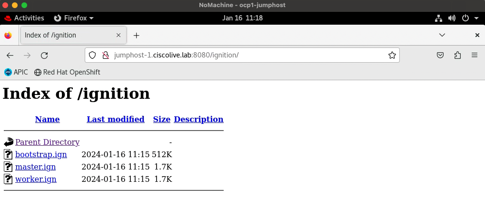

## 📚 Theory

Since the networking configuration on both ACI and our jumphost machines is prepared, with all the necessary services running and tools being in place, we can now boot up our cluster nodes and start the installation.

During the installation, we will generate the Kubernetes manifest and Ignition config files that the cluster needs to configure the machines and upload them to our web server. We will then power on our cluster nodes, which currently are turned off. Since the nodes are VMs acting as baremetal hosts, we will use IPMI commands to power them on, thanks to the VirtualBMC for vSphere tool. Once the nodes are powered on, they will boot using PXE, with DHCP assigning IP addresses to the nodes, pointing them to the URL from which they'll install RHCOS and download Ignition files.

Let's proceed.

## 💻 Practice

### 1. Copy the install-config.yaml file from ~/ocpinstall to ~/ocpinstall/upi directory.

The installation configuration files are all pruned when you will be running the openshift-install installation program in the ensuing steps, so be sure to copy the install-config.yaml and NOT move it. This way in case something goes awry during the installation, you have a back up of this configuration file and can reuse it. 

```
cisco@jumphost-1 ~/ocpinstall $ cp install-config.yaml upi/
cisco@jumphost-1 ~/ocpinstall $ ls -la upi
total 4
drwxrwxr-x 2 cisco cisco   33 01-16 10:12 .
drwxrwxr-x 3 cisco cisco   44 01-02 12:35 ..
-rw-r--r-- 1 cisco cisco 3769 01-16 10:12 install-config.yaml
```


### 2. Generate cluster manifests using the `openshift-install create manifests --dir /home/cisco/ocpinstall/upi` command.

The installation directory specified after the `--dir` parameter must contain the install-config.yaml that we copied in the previous step.

```
cisco@jumphost-1 ~/ocpinstall $ openshift-install create manifests --dir /home/cisco/ocpinstall/upi
INFO Consuming Install Config from target directory
WARNING Making control-plane schedulable by setting MastersSchedulable to true for Scheduler cluster settings
INFO Manifests created in: /home/cisco/ocpinstall/upi/manifests and /home/cisco/ocpinstall/upi/openshift
```

Afterwards, you can verify the files that have been created in the mentioned subdirectories.

```
cisco@jumphost-1 ~/ocpinstall $ ls -ltrR upi/
upi/:
total 8
drwxr-x--- 2 cisco cisco 4096 01-16 10:34 manifests
drwxr-x--- 2 cisco cisco 4096 01-16 10:34 openshift

upi/manifests:
total 60
-rw-r----- 1 cisco cisco 4034 01-16 10:34 machine-config-server-tls-secret.yaml
-rw-r----- 1 cisco cisco 1304 01-16 10:34 kube-system-configmap-root-ca.yaml
-rw-r----- 1 cisco cisco  118 01-16 10:34 kube-cloud-config.yaml
-rw-r----- 1 cisco cisco  200 01-16 10:34 cvo-overrides.yaml
-rw-r----- 1 cisco cisco  170 01-16 10:34 cluster-scheduler-02-config.yml
-rw-r----- 1 cisco cisco  142 01-16 10:34 cluster-proxy-01-config.yaml
-rw-r----- 1 cisco cisco  266 01-16 10:34 cluster-network-02-config.yml
-rw-r----- 1 cisco cisco 9607 01-16 10:34 cluster-network-01-crd.yml
-rw-r----- 1 cisco cisco  221 01-16 10:34 cluster-ingress-02-config.yml
-rw-r----- 1 cisco cisco  509 01-16 10:34 cluster-infrastructure-02-config.yml
-rw-r----- 1 cisco cisco  185 01-16 10:34 cluster-dns-02-config.yml
-rw-r----- 1 cisco cisco 1655 01-16 10:34 cluster-config.yaml
-rw-r----- 1 cisco cisco 3849 01-16 10:34 openshift-config-secret-pull-secret.yaml

upi/openshift:
total 24
-rw-r----- 1 cisco cisco  964 01-16 10:34 99_openshift-machineconfig_99-master-ssh.yaml
-rw-r----- 1 cisco cisco 2454 01-16 10:34 99_openshift-cluster-api_master-user-data-secret.yaml
-rw-r----- 1 cisco cisco  964 01-16 10:34 99_openshift-machineconfig_99-worker-ssh.yaml
-rw-r----- 1 cisco cisco 2454 01-16 10:34 99_openshift-cluster-api_worker-user-data-secret.yaml
-rw-r----- 1 cisco cisco  174 01-16 10:34 openshift-install-manifests.yaml
-rw-r----- 1 cisco cisco  181 01-16 10:34 99_kubeadmin-password-secret.yaml
```

As you can see, the install-config.yaml file has been pruned during the execution of the `openshift-install create manifests` command. In case you would need re-install your cluster, you would need to make sure that all files in the /upi directory are deleted.


### 3. Ensure that the `mastersSchedulable` parameter in the upi/manifests/cluster-scheduler-02-config.yml file is set to `true`. This enables your application workloads to run on the control plane nodes, which is the case in our environment where we don't have separate machines to act as compute nodes. 

```
cisco@jumphost-1 ~/ocpinstall $ cat upi/manifests/cluster-scheduler-02-config.yml
apiVersion: config.openshift.io/v1
kind: Scheduler
metadata:
  creationTimestamp: null
  name: cluster
spec:
  mastersSchedulable: true
  policy:
    name: ""
status: {}
```


### 4. Extract all the ACI CNI manifest files generated when running acc-provision from the /home/cisco/aci_manifests.tar.gz to the /home/cisco/ocpinstall/upi/manifests/ directory.

```
cisco@jumphost-1 ~/ocpinstall $ tar -xvf /home/cisco/aci_deployment.tar.gz -C upi/manifests/
cluster-network-04-CustomResourceDefinition-acicontainersoperators.aci.ctrl.yaml
cluster-network-05-Namespace-aci-containers-system.yaml
cluster-network-06-PriorityClass-acicni-priority.yaml
cluster-network-07-CustomResourceDefinition-nodepodifs.aci.aw.yaml
cluster-network-08-CustomResourceDefinition-snatglobalinfos.aci.snat.yaml
cluster-network-09-CustomResourceDefinition-snatlocalinfos.aci.snat.yaml
cluster-network-10-CustomResourceDefinition-snatpolicies.aci.snat.yaml
cluster-network-11-CustomResourceDefinition-nodeinfos.aci.snat.yaml
cluster-network-12-CustomResourceDefinition-rdconfigs.aci.snat.yaml
cluster-network-13-CustomResourceDefinition-networkpolicies.aci.netpol.yaml
cluster-network-14-CustomResourceDefinition-dnsnetworkpolicies.aci.dnsnetpol.yaml
cluster-network-15-CustomResourceDefinition-qospolicies.aci.qos.yaml
cluster-network-16-CustomResourceDefinition-netflowpolicies.aci.netflow.yaml
cluster-network-17-CustomResourceDefinition-erspanpolicies.aci.erspan.yaml
cluster-network-18-CustomResourceDefinition-enabledroplogs.aci.droplog.yaml
cluster-network-19-CustomResourceDefinition-prunedroplogs.aci.droplog.yaml
cluster-network-20-CustomResourceDefinition-accprovisioninputs.aci.ctrl.yaml
cluster-network-21-ConfigMap-aci-operator-config.yaml
cluster-network-22-ConfigMap-acc-provision-config.yaml
cluster-network-23-ConfigMap-aci-containers-config.yaml
cluster-network-24-ConfigMap-snat-operator-config.yaml
cluster-network-25-Secret-aci-user-cert.yaml
cluster-network-26-ServiceAccount-aci-containers-controller.yaml
cluster-network-27-ServiceAccount-aci-containers-host-agent.yaml
cluster-network-28-ClusterRole-aci-containers-controller.yaml
cluster-network-29-ClusterRole-aci-containers-host-agent.yaml
cluster-network-30-ClusterRoleBinding-aci-containers-controller.yaml
cluster-network-31-ClusterRoleBinding-aci-containers-host-agent.yaml
cluster-network-32-DaemonSet-aci-containers-host.yaml
cluster-network-33-DaemonSet-aci-containers-openvswitch.yaml
cluster-network-34-Deployment-aci-containers-controller.yaml
cluster-network-35-LimitRange-memory-limit-range.yaml
cluster-network-36-ServiceAccount-aci-containers-operator.yaml
cluster-network-37-ClusterRole-aci-containers-operator.yaml
cluster-network-38-ClusterRoleBinding-aci-containers-operator.yaml
cluster-network-39-Deployment-aci-containers-operator.yaml
cisco@jumphost-1 ~/ocpinstall $
cisco@jumphost-1 ~/ocpinstall $ ls -la upi/manifests/
total 324
drwxr-x--- 2 cisco cisco  4096 01-16 10:47 .
drwxrwxr-x 4 cisco cisco   107 01-16 10:34 ..
-rw-r----- 1 cisco cisco  1655 01-16 10:34 cluster-config.yaml
-rw-r----- 1 cisco cisco   185 01-16 10:34 cluster-dns-02-config.yml
-rw-r----- 1 cisco cisco   509 01-16 10:34 cluster-infrastructure-02-config.yml
-rw-r----- 1 cisco cisco   221 01-16 10:34 cluster-ingress-02-config.yml
-rw-r----- 1 cisco cisco  9607 01-16 10:34 cluster-network-01-crd.yml
-rw-r----- 1 cisco cisco   266 01-16 10:34 cluster-network-02-config.yml
-rw-rw-r-- 1 cisco cisco  1276 01-16 07:18 cluster-network-04-CustomResourceDefinition-acicontainersoperators.aci.ctrl.yaml
-rw-rw-r-- 1 cisco cisco   478 01-16 07:18 cluster-network-05-Namespace-aci-containers-system.yaml
-rw-rw-r-- 1 cisco cisco   189 01-16 07:18 cluster-network-06-PriorityClass-acicni-priority.yaml
-rw-rw-r-- 1 cisco cisco  1255 01-16 07:18 cluster-network-07-CustomResourceDefinition-nodepodifs.aci.aw.yaml
-rw-rw-r-- 1 cisco cisco  2069 01-16 07:18 cluster-network-08-CustomResourceDefinition-snatglobalinfos.aci.snat.yaml
-rw-rw-r-- 1 cisco cisco  1824 01-16 07:18 cluster-network-09-CustomResourceDefinition-snatlocalinfos.aci.snat.yaml
-rw-rw-r-- 1 cisco cisco  1334 01-16 07:18 cluster-network-10-CustomResourceDefinition-snatpolicies.aci.snat.yaml
-rw-rw-r-- 1 cisco cisco   889 01-16 07:18 cluster-network-11-CustomResourceDefinition-nodeinfos.aci.snat.yaml
-rw-rw-r-- 1 cisco cisco   928 01-16 07:18 cluster-network-12-CustomResourceDefinition-rdconfigs.aci.snat.yaml
-rw-rw-r-- 1 cisco cisco 20194 01-16 07:18 cluster-network-13-CustomResourceDefinition-networkpolicies.aci.netpol.yaml
-rw-rw-r-- 1 cisco cisco  3852 01-16 07:18 cluster-network-14-CustomResourceDefinition-dnsnetworkpolicies.aci.dnsnetpol.yaml
-rw-rw-r-- 1 cisco cisco  1530 01-16 07:18 cluster-network-15-CustomResourceDefinition-qospolicies.aci.qos.yaml
-rw-rw-r-- 1 cisco cisco  1643 01-16 07:18 cluster-network-16-CustomResourceDefinition-netflowpolicies.aci.netflow.yaml
-rw-rw-r-- 1 cisco cisco  2032 01-16 07:18 cluster-network-17-CustomResourceDefinition-erspanpolicies.aci.erspan.yaml
-rw-rw-r-- 1 cisco cisco  1166 01-16 07:18 cluster-network-18-CustomResourceDefinition-enabledroplogs.aci.droplog.yaml
-rw-rw-r-- 1 cisco cisco  1512 01-16 07:18 cluster-network-19-CustomResourceDefinition-prunedroplogs.aci.droplog.yaml
-rw-rw-r-- 1 cisco cisco  5949 01-16 07:18 cluster-network-20-CustomResourceDefinition-accprovisioninputs.aci.ctrl.yaml
-rw-rw-r-- 1 cisco cisco 86661 01-16 07:18 cluster-network-21-ConfigMap-aci-operator-config.yaml
-rw-rw-r-- 1 cisco cisco  2773 01-16 07:18 cluster-network-22-ConfigMap-acc-provision-config.yaml
-rw-rw-r-- 1 cisco cisco  8199 01-16 07:18 cluster-network-23-ConfigMap-aci-containers-config.yaml
-rw-rw-r-- 1 cisco cisco   284 01-16 07:18 cluster-network-24-ConfigMap-snat-operator-config.yaml
-rw-rw-r-- 1 cisco cisco  2397 01-16 07:18 cluster-network-25-Secret-aci-user-cert.yaml
-rw-rw-r-- 1 cisco cisco   197 01-16 07:18 cluster-network-26-ServiceAccount-aci-containers-controller.yaml
-rw-rw-r-- 1 cisco cisco   197 01-16 07:18 cluster-network-27-ServiceAccount-aci-containers-host-agent.yaml
-rw-rw-r-- 1 cisco cisco  2429 01-16 07:18 cluster-network-28-ClusterRole-aci-containers-controller.yaml
-rw-rw-r-- 1 cisco cisco  1663 01-16 07:18 cluster-network-29-ClusterRole-aci-containers-host-agent.yaml
-rw-rw-r-- 1 cisco cisco   395 01-16 07:18 cluster-network-30-ClusterRoleBinding-aci-containers-controller.yaml
-rw-rw-r-- 1 cisco cisco   395 01-16 07:18 cluster-network-31-ClusterRoleBinding-aci-containers-host-agent.yaml
-rw-rw-r-- 1 cisco cisco  5336 01-16 07:18 cluster-network-32-DaemonSet-aci-containers-host.yaml
-rw-rw-r-- 1 cisco cisco  2478 01-16 07:18 cluster-network-33-DaemonSet-aci-containers-openvswitch.yaml
-rw-rw-r-- 1 cisco cisco  2815 01-16 07:18 cluster-network-34-Deployment-aci-containers-controller.yaml
-rw-rw-r-- 1 cisco cisco   211 01-16 07:18 cluster-network-35-LimitRange-memory-limit-range.yaml
-rw-rw-r-- 1 cisco cisco   195 01-16 07:18 cluster-network-36-ServiceAccount-aci-containers-operator.yaml
-rw-rw-r-- 1 cisco cisco  1795 01-16 07:18 cluster-network-37-ClusterRole-aci-containers-operator.yaml
-rw-rw-r-- 1 cisco cisco   389 01-16 07:18 cluster-network-38-ClusterRoleBinding-aci-containers-operator.yaml
-rw-rw-r-- 1 cisco cisco  3467 01-16 07:18 cluster-network-39-Deployment-aci-containers-operator.yaml
-rw-r----- 1 cisco cisco   142 01-16 10:34 cluster-proxy-01-config.yaml
-rw-r----- 1 cisco cisco   170 01-16 10:34 cluster-scheduler-02-config.yml
-rw-r----- 1 cisco cisco   200 01-16 10:34 cvo-overrides.yaml
-rw-r----- 1 cisco cisco   118 01-16 10:34 kube-cloud-config.yaml
-rw-r----- 1 cisco cisco  1304 01-16 10:34 kube-system-configmap-root-ca.yaml
-rw-r----- 1 cisco cisco  4034 01-16 10:34 machine-config-server-tls-secret.yaml
-rw-r----- 1 cisco cisco  3849 01-16 10:34 openshift-config-secret-pull-secret.yaml
```


### 5. Create the Ignition configuration files by running the `openshift-install create ignition-configs --dir /home/cisco/ocpinstall/upi` command. 

```
cisco@jumphost-1 ~/ocpinstall $ openshift-install create ignition-configs --dir /home/cisco/ocpinstall/upi/
INFO Consuming Openshift Manifests from target directory
INFO Consuming Common Manifests from target directory
INFO Consuming OpenShift Install (Manifests) from target directory
INFO Consuming Worker Machines from target directory
INFO Consuming Master Machines from target directory
INFO Ignition-Configs created in: /home/cisco/ocpinstall/upi and /home/cisco/ocpinstall/upi/auth
```

After running this command, all previously generated manifests will be deleted, with the Ignition files created in their place, incorporating data from said manifests. Ignition config files are created for the bootstrap, control plane, and compute nodes in the installation directory. The kubeadmin-password and kubeconfig files are created in the upi/auth subdirectory. 

```
cisco@jumphost-1 ~/ocpinstall $ ls -ltrR upi/
upi/:
total 528
drwxr-x--- 2 cisco cisco     50 01-16 10:51 auth
-rw-r----- 1 cisco cisco   1719 01-16 10:51 master.ign
-rw-r----- 1 cisco cisco   1719 01-16 10:51 worker.ign
-rw-r----- 1 cisco cisco 524683 01-16 10:51 bootstrap.ign
-rw-r----- 1 cisco cisco     94 01-16 10:51 metadata.json

upi/auth:
total 16
-rw-r----- 1 cisco cisco 8945 01-16 10:51 kubeconfig
-rw-r----- 1 cisco cisco   23 01-16 10:51 kubeadmin-password
```

You can check the output of the Ignition files - majority of them is encoded using base64, thus for conciseness we won't be pasting their outputs in this lab guide. You can also verify the contents of the upi/metadata.json file, containing the cluster name, ID and infra ID properties, as well as the contents of upi/auth/kubeconfig file, which will later be used by the oc tool to authenticate against the API server of the OpenShift cluster.

```
cisco@jumphost-1 ~/ocpinstall $ cat upi/metadata.json
{"clusterName":"ocp","clusterID":"c46b2bea-1190-4a60-abbe-6801f2b0bd2e","infraID":"ocp-fpcwc"}
cisco@jumphost-1 ~/ocpinstall $
cisco@jumphost-1 ~/ocpinstall $ cat upi/auth/kubeconfig
clusters:
- cluster:
    certificate-authority-data: [...]
    server: https://api.ocp.ciscolive.lab:6443
  name: ocp
contexts:
- context:
    cluster: ocp
    user: admin
  name: admin
current-context: admin
preferences: {}
users:
- name: admin
  user:
    client-certificate-data: [...]
    client-key-data: [...]
```


### 6. Copy all Ignition files to the HTTP server directory at /var/www/html/ignition/.

```
cisco@jumphost-1 ~/ocpinstall $ sudo cp upi/*.ign /var/www/html/ignition/
cisco@jumphost-1 ~/ocpinstall $ sudo chmod +rw /var/www/html/ignition/*
cisco@jumphost-1 ~/ocpinstall $ ls -la /var/www/html/ignition/
total 524
drwxr-xr-x. 2 root root     63 01-16 11:15 .
drwxr-xr-x. 4 root root     51 01-02 04:15 ..
-rw-r--r--  1 root root 524683 01-16 11:15 bootstrap.ign
-rw-r--r--  1 root root   1719 01-16 11:15 master.ign
-rw-r--r--  1 root root   1719 01-16 11:15 worker.ign
```


### 7. Verify whether the Ignition files are accessible on the webserver. Modify the URL according to the hostname of your jumphost machine.

```
cisco@jumphost-1 ~/ocpinstall $ curl -v http://jumphost-1.ciscolive.lab:8080/ignition/master.ign
*   Trying 172.18.0.31...
* TCP_NODELAY set
* Connected to jumphost-1.ciscolive.lab (172.18.0.31) port 8080 (#0)
> GET /ignition/master.ign HTTP/1.1
> Host: jumphost-1.ciscolive.lab:8080
> User-Agent: curl/7.61.1
> Accept: */*
>
< HTTP/1.1 200 OK
< Date: Tue, 16 Jan 2024 17:17:11 GMT
< Server: Apache/2.4.37 (Red Hat Enterprise Linux) mod_wsgi/4.6.4 Python/3.6
< Last-Modified: Tue, 16 Jan 2024 17:15:01 GMT
< ETag: "6b7-60f134542a3fa"
< Accept-Ranges: bytes
< Content-Length: 1719
< Content-Type: application/vnd.coreos.ignition+json
<
{"ignition":{"config":{"merge":[{"source":"https://api-int.ocp.ciscolive.lab:22623/config/master"}]},"security":{"tls":{"certificateAuthorities":[{"source":"data:text/plain;charset=utf-8;base64,LS0tLS1CRUdJTiBDRVJUSUZJQ0FURS0tLS0tCk1JSURFRENDQWZpZ0F3SUJBZ0lJZVpoK3VRNjhQV3d3RFFZSktvWklodmNOQVFFTEJRQXdKakVTTUJBR0ExVUUKQ3hNSmIzQmxibk5vYVdaME1SQXdEZ1lEVlFRREV3ZHliMjkwTFdOaE1CNFhEVEkwTURFeE5qRTJNelF3TUZvWApEVE0wTURFeE16RTJNelF3TUZvd0pqRVNNQkFHQTFVRUN4TUpiM0JsYm5Ob2FXWjBNUkF3RGdZRFZRUURFd2R5CmIyOTBMV05oTUlJQklqQU5CZ2txaGtpRzl3MEJBUUVGQUFPQ0FROEFNSUlCQ2dLQ0FRRUFyY2orSGxLV2RpWXgKeFltWkVTQTlJbjRVWStvSEpMbDJONTZLc3Y2Ny9JN1NzbDhSYnlSUVVWWDlRc1VLOElKSW1QVkxrT0pMWmJhYwpsb2UzcmxFSENyY1V4aXYvRUMyaERpRXpsYjhyczZDRWZxbnVWUTVHTUpONHVIdjYwVk1iRGdmaVovZjc5anJJCjdBbmFGR3NzZ0lESjVTK0J1WjRXS2lrQ0EycHlGTHFMMDZCNDcxbGIvVnJtMkt3UWwxUzhUQkcrTzY1YjdhQisKbGtXOTdjV0hJTW9zVGwxOFRINitjMnE4OEg2N054RUFDWUhqKzdKKzZyQVBndEtoNCtvcy9xdEp4ang4Q1FZRQpiZlpPblFEUGROc3pVYWtlNDV6dllsZHhtYzQ2b0JTa210S3Y3SlpXU2o3ODJ4S2xSSFNPMFVOeTVTQ3E0ekRWClloUEV0M2Fpc1* Connection #0 to host jumphost-1.ciscolive.lab left intact
FJREFRQUJvMEl3UURBT0JnTlZIUThCQWY4RUJBTUNBcVF3RHdZRFZSMFRBUUgvQkFVd0F3RUIKL3pBZEJnTlZIUTRFRmdRVXRzYnR1M285RkV4OVNqR0JCd2l3ZEhzbzBod3dEUVlKS29aSWh2Y05BUUVMQlFBRApnZ0VCQURNZ25xUXZhSnFHODFYK012cjl4Y1JnM01WRXoyVGpsRldZTWJaM3JlRytvcENNVUlxRDZ5d2htb1VGCk5hYWNxV0Q3MG4wa0ZtYVFMSFRGQS83TjJmdmtlNkNuemlwWU00WTVUbzhudWNMTzAzQVlqUXptYXEzMGlCUHIKelpCalk4TmFLaE8rTlcrYTlEL1JydWpuYWdTMVV5WFkyV0l3QUhha3dzM1lyNjFVVURRWDdOUW5aaTY3alJLTApBc3pjRW92T3kwYWxXVmRRNDVENWhJdk1ZaXZhbVhKMXRsb0NURFNvOC93OVBOVC9mMEVMZUtBZGNQTmVpY3ZZCjZxM1RHcjRJNThyK2lOYUc5b0l4elUrRlc4VllJZ1V4SXFHdWF1M25ET0UrL0ZaS1dmbVhod2luWFlIQ2tDVFMKN0Nob0tNZDVQY1hXb3FkRWY0R1VXd2VPcHZvPQotLS0tLUVORCBDRVJUSUZJQ0FURS0tLS0tCg=="}]}},"version":"3.2.0"}}
```




### 8. Power on the OpenShift nodes.

After powering on the bootstrap node, PXE boot procedure will start. In order to power the nodes on, we're using vsbmc and ipmitool commands. First, run the `vsbmc add` commands to add new virtual BMCs to control cluster VMs.

```
cisco@jumphost-1 ~/ocpinstall $ vsbmc add --username admin --password password --port 6230 --viserver vc01.dmz.krk.cxlabs --viserver-username administrator@vsphere.local --viserver-password 'L1ons@svs' cl-ocp-1-bootstrap
cisco@jumphost-1 ~/ocpinstall $ vsbmc add --username admin --password password --port 6231 --viserver vc01.dmz.krk.cxlabs --viserver-username administrator@vsphere.local --viserver-password 'L1ons@svs' cl-ocp-1-master1
cisco@jumphost-1 ~/ocpinstall $ vsbmc add --username admin --password password --port 6232 --viserver vc01.dmz.krk.cxlabs --viserver-username administrator@vsphere.local --viserver-password 'L1ons@svs' cl-ocp-1-master2
cisco@jumphost-1 ~/ocpinstall $ vsbmc add --username admin --password password --port 6233 --viserver vc01.dmz.krk.cxlabs --viserver-username administrator@vsphere.local --viserver-password 'L1ons@svs' cl-ocp-1-master3
```

These commands bind network ports, with each responding to according VM. Each of these ports will be listening for the IPMI commands, and upon receiving them, vsbmc daemon will communicate with VMOMI service on the vCenter server to take action against VMs, for example power a VM on. For that, you also need to pass the vCenter server address and credentials within the command, using the `--viserver`, `--viserver-username` and `--viserver-password` parameters. This is not to be mixed up with the `--username` and `--password` parameters, used to set up IPMI credentials, later used by the ipmitool commands.

Afterwards, use the `vsbmc start` command to start virtual BMC to control VMs.

```
cisco@jumphost-1 ~/ocpinstall $ vsbmc start cl-ocp-1-bootstrap
cisco@jumphost-1 ~/ocpinstall $ vsbmc start cl-ocp-1-master1
cisco@jumphost-1 ~/ocpinstall $ vsbmc start cl-ocp-1-master2
cisco@jumphost-1 ~/ocpinstall $ vsbmc start cl-ocp-1-master3
```

This way you've started virtual BMC for each of the cluster nodes. You can confirm that by running the `vsbmc list` command.

```
cisco@jumphost-1 ~/ocpinstall $ vsbmc list
+--------------------+---------+---------+------+
| VM name            | Status  | Address | Port |
+--------------------+---------+---------+------+
| cl-ocp-1-bootstrap | running | ::      | 6230 |
| cl-ocp-1-master1   | running | ::      | 6231 |
| cl-ocp-1-master2   | running | ::      | 6232 |
| cl-ocp-1-master3   | running | ::      | 6233 |
+--------------------+---------+---------+------+
```

While the `vsbmc list` output shows the virtual BMC sessions for each node as running, the actual VMs are not yet powered on. To do that, you have to issue IPMI commands against the address and port of that virtual BMC to control the VM power state.

```
cisco@jumphost-1 ~/ocpinstall $ ipmitool -I lanplus -U admin -P password -H localhost -p 6230 power on
Chassis Power Control: Up/On
cisco@jumphost-1 ~/ocpinstall $ ipmitool -I lanplus -U admin -P password -H localhost -p 6231 power on
Chassis Power Control: Up/On
cisco@jumphost-1 ~/ocpinstall $ ipmitool -I lanplus -U admin -P password -H localhost -p 6232 power on
Chassis Power Control: Up/On
cisco@jumphost-1 ~/ocpinstall $ ipmitool -I lanplus -U admin -P password -H localhost -p 6233 power on
Chassis Power Control: Up/On
```

Once you power on the nodes, the PXE boot will commence.


### 9. You can verify the progress of the bootstrapping process by using thie `openshift-install wait-for bootstrap-complete` command, which has to be ran from the upi directory.

```
cisco@jumphost-1 ~/ocpinstall $ cd upi
cisco@jumphost-1 ~/ocpinstall/upi $ openshift-install wait-for bootstrap-complete
INFO Waiting up to 20m0s (until 3:18PM) for the Kubernetes API at https://api.ocp.ciscolive.lab:6443...
INFO API v1.26.11+8cfd402 up
INFO Waiting up to 30m0s (until 3:31PM) for bootstrapping to complete...
```

You can also SSH to the cluster nodes using `core` username, using the private RSA key provided earlier in the install-config.yaml file. You can SSH to the bootstrap machine and check progress of bootstrap node installation – different manifests are rendered and containers are started. 

```
cisco@jumphost-1 ~ $ ssh core@192.168.1.8
The authenticity of host '192.168.1.8 (192.168.1.8)' can't be established.
ECDSA key fingerprint is SHA256:/cJQ39kWVwG/K/49clNkey8v1k/UlD9O6btxKJANbkU.
Are you sure you want to continue connecting (yes/no/[fingerprint])? yes
Warning: Permanently added '192.168.1.8' (ECDSA) to the list of known hosts.
Red Hat Enterprise Linux CoreOS 414.92.202310170514-0
  Part of OpenShift 4.14, RHCOS is a Kubernetes native operating system
  managed by the Machine Config Operator (`clusteroperator/machine-config`).

WARNING: Direct SSH access to machines is not recommended; instead,
make configuration changes via `machineconfig` objects:
  https://docs.openshift.com/container-platform/4.14/architecture/architecture-rhcos.html

---
This is the bootstrap node; it will be destroyed when the master is fully up.

The primary services are release-image.service followed by bootkube.service. To watch their status, run e.g.

  journalctl -b -f -u release-image.service -u bootkube.service
[core@bootstrap ~]$
```

As seen in the MOTD, you can check the state of the bootstrapping process with more details by using the `journalctl -b -f -u release-image.service -u bootkube.service`. The output will look similar to the one below, albeit we've shortened it and omitted parts for brevity:

```
[core@bootstrap ~]$ journalctl -b -f -u release-image.service -u bootkube.service
[...]
Jan 16 21:00:44 bootstrap.ciscolive.lab bootkube.sh[5196]: time="2024-01-16T21:00:44Z" level=info msg="Writing file: /assets/cco-bootstrap/manifests/cco-cloudcredential_v1_credentialsrequest_crd.yaml"
Jan 16 21:00:44 bootstrap.ciscolive.lab bootkube.sh[5196]: time="2024-01-16T21:00:44Z" level=info msg="Writing file: /assets/cco-bootstrap/manifests/cco-namespace.yaml"
Jan 16 21:00:44 bootstrap.ciscolive.lab bootkube.sh[5196]: time="2024-01-16T21:00:44Z" level=info msg="Writing file: /assets/cco-bootstrap/manifests/cco-operator-config.yaml"
Jan 16 21:00:44 bootstrap.ciscolive.lab bootkube.sh[5196]: time="2024-01-16T21:00:44Z" level=info msg="Rendering static pod"
Jan 16 21:00:44 bootstrap.ciscolive.lab bootkube.sh[5196]: time="2024-01-16T21:00:44Z" level=info msg="writing file: /assets/cco-bootstrap/bootstrap-manifests/cloud-credential-operator-pod.yaml"
Jan 16 21:00:44 bootstrap.ciscolive.lab bootkube.sh[5458]: https://localhost:2379 is healthy: successfully committed proposal: took = 9.396576ms
Jan 16 21:00:44 bootstrap.ciscolive.lab bootkube.sh[2460]: Starting cluster-bootstrap...
Jan 16 21:00:49 bootstrap.ciscolive.lab bootkube.sh[5541]: Starting temporary bootstrap control plane...
Jan 16 21:00:49 bootstrap.ciscolive.lab bootkube.sh[5541]: Waiting up to 20m0s for the Kubernetes API
Jan 16 21:00:50 bootstrap.ciscolive.lab bootkube.sh[5541]: Still waiting for the Kubernetes API: Get "https://localhost:6443/readyz": dial tcp [::1]:6443: connect: connection refused
Jan 16 21:01:06 bootstrap.ciscolive.lab bootkube.sh[5541]: API is up
Jan 16 21:01:06 bootstrap.ciscolive.lab bootkube.sh[5541]: Created "0000_00_cluster-version-operator_00_namespace.yaml" namespaces.v1./openshift-cluster-version -n
Jan 16 21:01:06 bootstrap.ciscolive.lab bootkube.sh[5541]: Failed to create "0000_00_cluster-version-operator_01_adminack_configmap.yaml" configmaps.v1./admin-acks -n openshift-config: namespaces "openshift-config" not found
Jan 16 21:01:06 bootstrap.ciscolive.lab bootkube.sh[5541]: Failed to create "0000_00_cluster-version-operator_01_admingate_configmap.yaml" configmaps.v1./admin-gates -n openshift-config-managed: namespaces "openshift-config-managed" not found
Jan 16 21:01:06 bootstrap.ciscolive.lab bootkube.sh[5541]: Created "0000_00_cluster-version-operator_01_clusteroperator.crd.yaml" customresourcedefinitions.v1.apiextensions.k8s.io/clusteroperators.config.openshift.io -n
Jan 16 21:01:06 bootstrap.ciscolive.lab bootkube.sh[5541]: Created "0000_00_cluster-version-operator_01_clusterversion.crd.yaml" customresourcedefinitions.v1.apiextensions.k8s.io/clusterversions.config.openshift.io -n
Jan 16 21:01:06 bootstrap.ciscolive.lab bootkube.sh[5541]: Created "0000_00_cluster-version-operator_02_roles.yaml" clusterrolebindings.v1.rbac.authorization.k8s.io/cluster-version-operator -n
Jan 16 21:01:16 bootstrap.ciscolive.lab bootkube.sh[5541]: Failed to create "0000_00_cluster-version-operator_03_deployment.yaml" deployments.v1.apps/cluster-version-operator -n openshift-cluster-version: deployments.apps "cluster-version-operator" is forbidden: quota.openshift.io/ClusterResourceQuota: caches not synchronized
Jan 16 21:01:16 bootstrap.ciscolive.lab bootkube.sh[5541]: Created "0000_00_namespace-openshift-infra.yaml" namespaces.v1./openshift-infra -n
Jan 16 21:01:16 bootstrap.ciscolive.lab bootkube.sh[5541]: Created "0000_03_authorization-openshift_01_rolebindingrestriction.crd.yaml" customresourcedefinitions.v1.apiextensions.k8s.io/rolebindingrestrictions.authorization.openshift.io -n
Jan 16 21:01:16 bootstrap.ciscolive.lab bootkube.sh[5541]: Created "0000_03_config-operator_01_proxy.crd.yaml" customresourcedefinitions.v1.apiextensions.k8s.io/proxies.config.openshift.io -n
Jan 16 21:01:16 bootstrap.ciscolive.lab bootkube.sh[5541]: Created "0000_03_quota-openshift_01_clusterresourcequota.crd.yaml" customresourcedefinitions.v1.apiextensions.k8s.io/clusterresourcequotas.quota.openshift.io -n
Jan 16 21:01:16 bootstrap.ciscolive.lab bootkube.sh[5541]: Created "0000_03_security-openshift_01_scc.crd.yaml" customresourcedefinitions.v1.apiextensions.k8s.io/securitycontextconstraints.security.openshift.io -n
[...]
```

You can also verify that the containers responsible for the OpenShift control plane operations, such as etcd or kube-apiserver, are standing up. To do that, you should run the `sudo crictl ps` command. OpenShift utilizes CRI as its container runtime, which is why you have to use the crictl command-line tool to check the state of particular containers. 

```
[core@bootstrap ~]$ sudo crictl ps
CONTAINER           IMAGE                                                                                                                    CREATED              STATE               NAME                             ATTEMPT             POD ID              POD
131660dcebffd       2999f97c406ca7b96fd979a57eb59e24e233a8a6695b8069dcf35a1998beaa54                                                         21 seconds ago       Running             kube-controller-manager          1                   c65ab1c86866c       bootstrap-kube-controller-manager-bootstrap.ciscolive.lab
6b03047a4229d       quay.io/openshift-release-dev/ocp-v4.0-art-dev@sha256:1517011cfc970b9ee4da05bf67265447ab3aa20fa1d65b0541b037178d584852   29 seconds ago       Running             cluster-policy-controller        0                   c65ab1c86866c       bootstrap-kube-controller-manager-bootstrap.ciscolive.lab
6e954ae61d079       7e0e949832cb2365f55136648b4e70268a2527a31a481cffcccd2bba9f223551                                                         33 seconds ago       Running             kube-apiserver-insecure-readyz   0                   eea0dc89b8253       bootstrap-kube-apiserver-bootstrap.ciscolive.lab
65127deddb202       2999f97c406ca7b96fd979a57eb59e24e233a8a6695b8069dcf35a1998beaa54                                                         33 seconds ago       Running             kube-apiserver                   0                   eea0dc89b8253       bootstrap-kube-apiserver-bootstrap.ciscolive.lab
fdfe8f994b428       quay.io/openshift-release-dev/ocp-v4.0-art-dev@sha256:b0aa709b180d806aeb57082e7c850d2269d04081a3322d705ddd0e01525cfa22   34 seconds ago       Running             kube-scheduler                   0                   51491c2e7b3d2       bootstrap-kube-scheduler-bootstrap.ciscolive.lab
c52305ac6e60f       quay.io/openshift-release-dev/ocp-release@sha256:bc9006f9160663663c6d9a735c4c497f8f3300d94a7ec45cdafef1cebb15ebfe        47 seconds ago       Running             cluster-version-operator         0                   44951e7b200fa       bootstrap-cluster-version-operator-bootstrap.ciscolive.lab
c27ae0748edbe       609bd8aea33cb0f40072a583cb4c6d7ce103707712c37c13dc588166cedd75f2                                                         48 seconds ago       Running             cloud-credential-operator        0                   7ee837bc134f7       cloud-credential-operator-bootstrap.ciscolive.lab
ec09c9dab0f57       8a680a289a6d1debde5a669fd07561187b47d83e9531c748b6d30545d2cd7e22                                                         58 seconds ago       Running             machine-config-server            0                   d521ebf3f54f9       bootstrap-machine-config-operator-bootstrap.ciscolive.lab
30de5fed2b280       503f69f362fb50421b396d86eb529f3c6cdbf2d824dff6b95f343ea96e5eaffb                                                         About a minute ago   Running             etcd                             0                   ad3f854bafd20       etcd-bootstrap-member-bootstrap.ciscolive.lab
855783e52bab8       quay.io/openshift-release-dev/ocp-v4.0-art-dev@sha256:977a89aa4b6d846c909990ed5a6b1f0f2be2e8d45c595ac4daae332ab914927e   About a minute ago   Running             etcdctl                          0                   ad3f854bafd20       etcd-bootstrap-member-bootstrap.ciscolive.lab
```

Since the bootstrapping procedure and installation procedure takes a while, at this point we will proceed with the second part of our presentation, acting as an introduction to Sections 2 and 3 of this lab.

That concludes Task 3 of Section 1. Please proceed to the next Task.