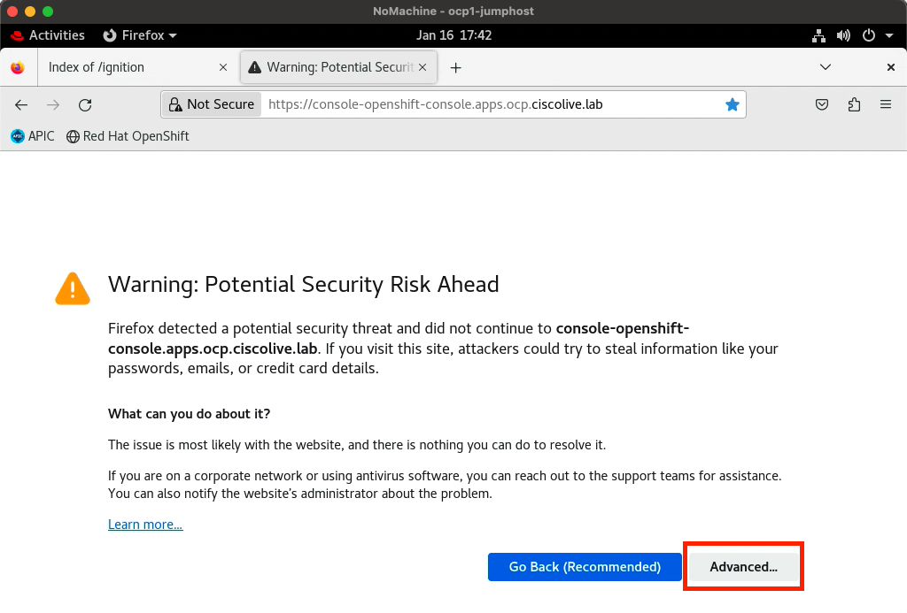
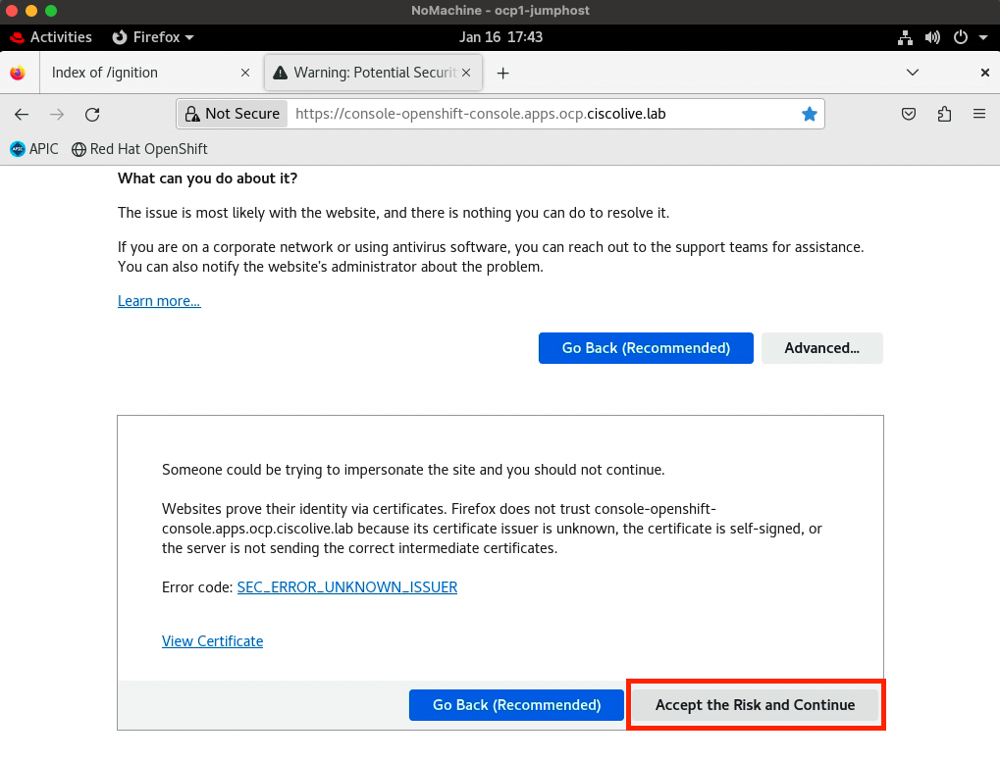
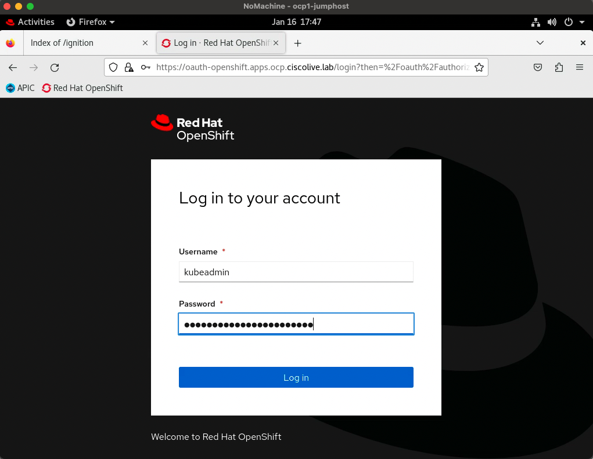
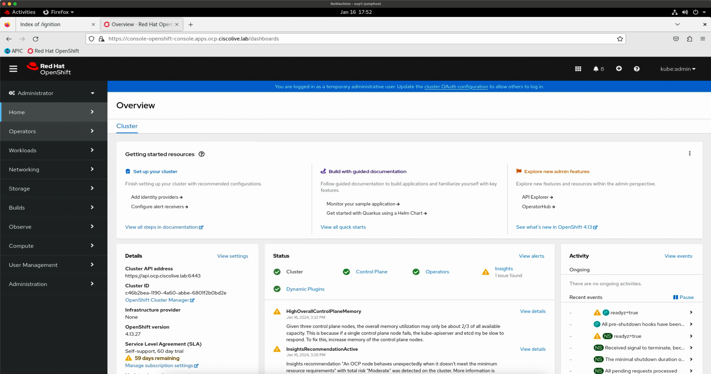
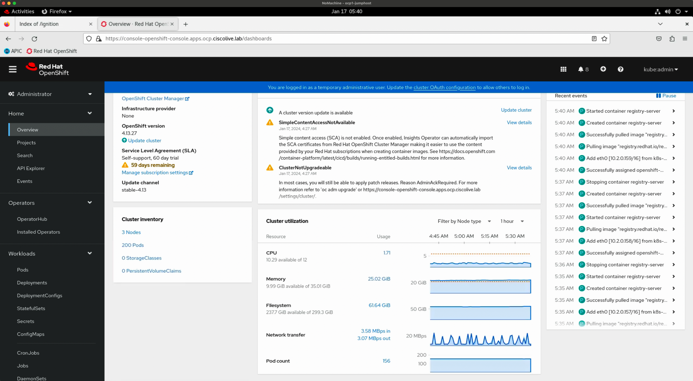
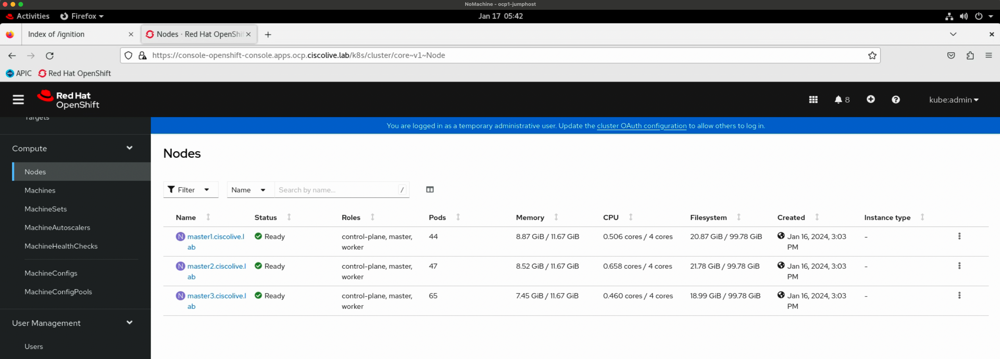
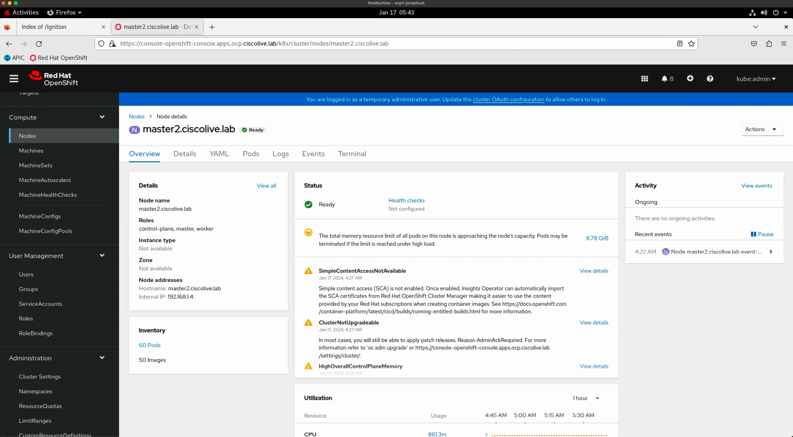
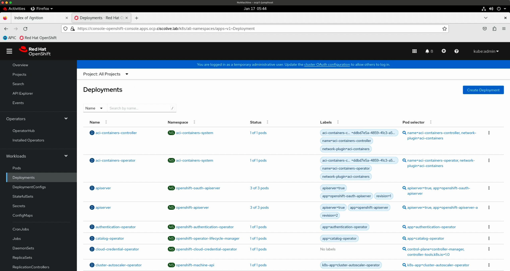
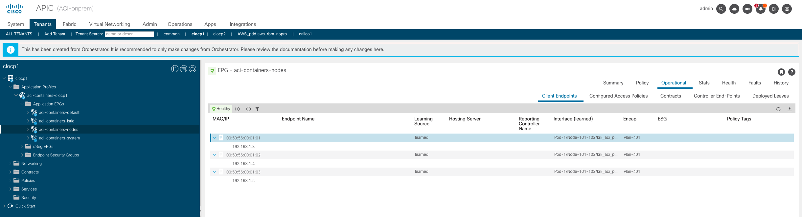
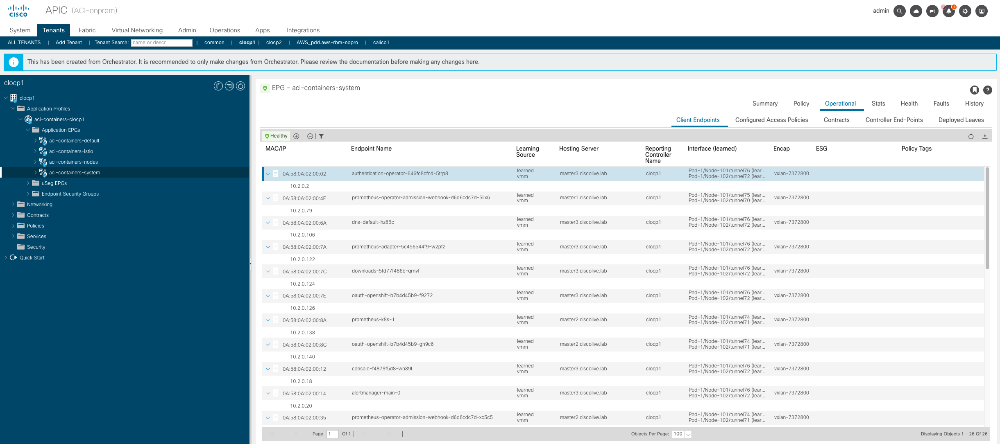

## 📚 Theory

We've launched the installation of OpenShift Container Platform on our machines. What now happens in the background is the bootstrapping process, where the temporary kube-apiserver stands up on the bootstrap machine, control plane nodes are joining the cluster, kube-apiserver pods are being launched on the control plane nodes, various cluster operators are being launched as well and the temporary kubeapi-server on the bootstrap is shut down. There is a set of terminal commands, as well as means accessible through the GUI to confirm that the cluster has been installed and is now operational. 

Let's proceed.

## 💻 Practice 

### 1. When the bootstrapping of the master nodes is finished, the bootstrap node can be deleted. The completion of the bootstrapping process would be confirmed in the output of the `openshift-install wait-for bootstrap-complete` command.

```
cisco@jumphost-1 ~/ocpinstall/upi $ openshift-install wait-for bootstrap-complete
INFO Waiting up to 20m0s (until 3:18PM) for the Kubernetes API at https://api.ocp.ciscolive.lab:6443...
INFO API v1.26.11+8cfd402 up
INFO Waiting up to 30m0s (until 3:31PM) for bootstrapping to complete...
INFO It is now safe to remove the bootstrap resources
INFO Time elapsed: 17m30s
```

To power off the bootstrap machine, you once again will have to use an IPMI command:

```
cisco@jumphost-1 ~/ocpinstall $ ipmitool -I lanplus -U admin -P password -H localhost -p 6230 power off
Chassis Power Control: Down/Off
```


### 2. When the API server comes up, you can start using the oc tool to check the state of particular pods and other components of the cluster.

You might see some pods being restarted or terminated, this is usual during the early stages of OpenShift installation.

```
cisco@jumphost-1 ~/ocpinstall $ export KUBECONFIG=/home/cisco/ocpinstall/upi/auth/kubeconfig
cisco@jumphost-1 ~/ocpinstall $ oc get pods -A
NAMESPACE                                          NAME                                                         READY   STATUS              RESTARTS        AGE
aci-containers-system                              aci-containers-controller-69d6c59f69-q9fdt                   1/1     Running    6 (93s ago)     15m
aci-containers-system                              aci-containers-host-2xhqh                                    3/3     Running             1 (12m ago)     14m
aci-containers-system                              aci-containers-host-jkrpb                                    3/3     Running             2 (5m34s ago)   13m
aci-containers-system                              aci-containers-host-stbwx                                    3/3     Running             2 (5m36s ago)   14m
aci-containers-system                              aci-containers-openvswitch-5jr5p                             1/1     Running             0               13m
aci-containers-system                              aci-containers-openvswitch-pdlkv                             1/1     Running             0               14m
aci-containers-system                              aci-containers-openvswitch-rwbhk                             1/1     Running             0               14m
aci-containers-system                              aci-containers-operator-fd8b5d66-fs7th                       2/2     Running             0               15m
openshift-apiserver-operator                       openshift-apiserver-operator-6c9bf67f65-nbc2w                1/1     Running             2 (5m36s ago)   13m
openshift-apiserver                                apiserver-778845969-kp2cx                                    0/2     Pending             0               22s
openshift-apiserver                                apiserver-778845969-p9bbt                                    2/2     Running             0               74s
openshift-apiserver                                apiserver-7899985b97-hxqbx                                   2/2     Running             0               4m17s
openshift-apiserver                                apiserver-7899985b97-lgw7l                                   2/2     Terminating         0               3m53s
openshift-authentication-operator                  authentication-operator-646fc8cfcd-5trp8                     1/1     Running             2 (5m36s ago)   13m
openshift-cloud-controller-manager-operator        cluster-cloud-controller-manager-operator-7d45fcc777-g7wwx   2/2     Running             2 (7m11s ago)   13m
openshift-cloud-credential-operator                cloud-credential-operator-c8d5f4948-spjt5                    2/2     Running             0               13m
openshift-cluster-machine-approver                 machine-approver-554d95ddd-s5xlx                             2/2     Running             1 (5m40s ago)   13m
openshift-cluster-node-tuning-operator             cluster-node-tuning-operator-5cd8fb9679-xtwqf                1/1     Running             1 (7m13s ago)   13m
openshift-cluster-node-tuning-operator             tuned-nwr4m                                                  1/1     Running             0               10m
openshift-cluster-node-tuning-operator             tuned-ph5lm                                                  1/1     Running             0               10m
openshift-cluster-node-tuning-operator             tuned-zssxf                                                  1/1     Running             0               10m
openshift-cluster-samples-operator                 cluster-samples-operator-548d75f468-f44x8                    2/2     Running             0               9m34s
openshift-cluster-storage-operator                 cluster-storage-operator-84fb46d6bd-wkl58                    1/1     Running             1 (10m ago)     14m
openshift-cluster-storage-operator                 csi-snapshot-controller-ccc76ff5f-mn5r8                      1/1     Running             0               12m
openshift-cluster-storage-operator                 csi-snapshot-controller-ccc76ff5f-xx5m9                      1/1     Running             1 (7m13s ago)   12m
openshift-cluster-storage-operator                 csi-snapshot-controller-operator-758465d69b-mwfzs            1/1     Running             1 (6m29s ago)   13m
openshift-cluster-storage-operator                 csi-snapshot-webhook-d47c85b5f-d68kx                         1/1     Running             0               12m
openshift-cluster-storage-operator                 csi-snapshot-webhook-d47c85b5f-pfcwt                         1/1     Running             0               12m
openshift-cluster-version                          cluster-version-operator-6b89847464-zngnj                    1/1     Running             0               13m
openshift-config-operator                          openshift-config-operator-865569586-tfm95                    1/1     Running             2 (5m36s ago)   14m
openshift-controller-manager-operator              openshift-controller-manager-operator-5746f55d79-n9vs9       1/1     Running             2 (5m36s ago)   13m
openshift-controller-manager                       controller-manager-68c844f777-8rvfd                          1/1     Running             0               10m
openshift-controller-manager                       controller-manager-68c844f777-cngdc                          1/1     Running             0               11m
openshift-controller-manager                       controller-manager-68c844f777-x7b4q                          1/1     Running             1 (6m28s ago)   10m
openshift-dns-operator                             dns-operator-777f8b854f-plc6b                                2/2     Running             0               13m
openshift-dns                                      dns-default-2gqz9                                            2/2     Running             0               10m
openshift-dns                                      dns-default-hz85c                                            2/2     Running             0               10m
openshift-dns                                      dns-default-vctqc                                            2/2     Running             0               10m
openshift-dns                                      node-resolver-7ktwp                                          1/1     Running             0               10m
openshift-dns                                      node-resolver-sjwzr                                          1/1     Running             0               10m
openshift-dns                                      node-resolver-wsbb6                                          1/1     Running             0               10m
openshift-etcd-operator                            etcd-operator-7cd7bf4fff-mk4dx                               1/1     Running             2 (5m40s ago)   14m
openshift-etcd                                     etcd-guard-master1.ciscolive.lab                             1/1     Running             0               4m20s
openshift-etcd                                     etcd-guard-master2.ciscolive.lab                             1/1     Running             0               10m
openshift-etcd                                     etcd-guard-master3.ciscolive.lab                             1/1     Running             0               96s
openshift-etcd                                     etcd-master1.ciscolive.lab                                   4/4     Running             0               2m57s
openshift-etcd                                     etcd-master2.ciscolive.lab                                   4/4     Running             0               5m39s
openshift-etcd                                     etcd-master3.ciscolive.lab                                   4/4     Running             0               106s
openshift-etcd                                     installer-2-master2.ciscolive.lab                            0/1     Completed           0               11m
openshift-etcd                                     installer-3-master1.ciscolive.lab                            0/1     Completed           0               5m14s
openshift-etcd                                     installer-3-master2.ciscolive.lab                            0/1     Completed           0               9m42s
openshift-etcd                                     installer-4-master1.ciscolive.lab                            0/1     Completed           0               4m6s
openshift-etcd                                     installer-4-master3.ciscolive.lab                            0/1     Completed           0               2m19s
openshift-etcd                                     installer-5-master2.ciscolive.lab                            1/1     Running             0               66s
openshift-image-registry                           cluster-image-registry-operator-899b746f4-2x2r6              1/1     Running             1 (5m40s ago)   14m
openshift-image-registry                           node-ca-8cs4w                                                0/1     Pending             0               22s
openshift-image-registry                           node-ca-9n446                                                0/1     Pending             0               22s
openshift-image-registry                           node-ca-r6k64                                                0/1     Pending             0               22s
openshift-ingress-canary                           ingress-canary-d5x8g                                         0/1     Pending             0               22s
openshift-ingress-canary                           ingress-canary-lngx2                                         0/1     Pending             0               22s
openshift-ingress-canary                           ingress-canary-q9x5d                                         0/1     Pending             0               22s
openshift-ingress-operator                         ingress-operator-75577b7d68-x7fvg                            2/2     Running             4 (2m51s ago)   13m
openshift-ingress                                  router-default-5cff98c998-28vzz                              0/1     Running             3 (105s ago)    10m
openshift-ingress                                  router-default-5cff98c998-sqd5v                              0/1     Running             3 (98s ago)     10m
openshift-insights                                 insights-operator-b4f5cd555-lldt2                            1/1     Running             1 (10m ago)     14m
openshift-kube-apiserver-operator                  kube-apiserver-operator-84fcdb656b-fl67m                     1/1     Running             2 (6m24s ago)   14m
openshift-kube-apiserver                           installer-2-master1.ciscolive.lab                            0/1     Error               0               9m35s
openshift-kube-apiserver                           installer-3-master1.ciscolive.lab                            0/1     Completed           0               2m32s
openshift-kube-apiserver                           installer-4-master1.ciscolive.lab                            0/1     Terminating         0               39s
openshift-kube-apiserver                           kube-apiserver-guard-master1.ciscolive.lab                   1/1     Running             0               87s
openshift-kube-apiserver                           kube-apiserver-master1.ciscolive.lab                         5/5     Running             0               93s
openshift-kube-controller-manager-operator         kube-controller-manager-operator-7dcbd89d8-9dwls             1/1     Running             2 (5m40s ago)   13m
openshift-kube-controller-manager                  installer-3-master1.ciscolive.lab                            0/1     Completed           0               11m
openshift-kube-controller-manager                  installer-4-master1.ciscolive.lab                            0/1     Completed           0               9m45s
openshift-kube-controller-manager                  installer-5-master1.ciscolive.lab                            0/1     Completed           0               2m5s
openshift-kube-controller-manager                  installer-5-master2.ciscolive.lab                            0/1     Completed           0               3m24s
openshift-kube-controller-manager                  installer-5-master3.ciscolive.lab                            0/1     Completed           0               4m58s
openshift-kube-controller-manager                  installer-6-master1.ciscolive.lab                            1/1     Terminating         0               50s
openshift-kube-controller-manager                  installer-7-master1.ciscolive.lab                            0/1     Pending             0               9s
openshift-kube-controller-manager                  kube-controller-manager-guard-master1.ciscolive.lab          0/1     Running             0               10m
openshift-kube-controller-manager                  kube-controller-manager-guard-master2.ciscolive.lab          1/1     Running             0               2m32s
openshift-kube-controller-manager                  kube-controller-manager-guard-master3.ciscolive.lab          1/1     Running             0               3m43s
openshift-kube-controller-manager                  kube-controller-manager-master1.ciscolive.lab                3/4     Running             0               76s
openshift-kube-controller-manager                  kube-controller-manager-master2.ciscolive.lab                4/4     Running             0               2m45s
openshift-kube-controller-manager                  kube-controller-manager-master3.ciscolive.lab                4/4     Running             0               3m52s
openshift-kube-proxy                               openshift-kube-proxy-24jx5                                   2/2     Running             0               13m
openshift-kube-proxy                               openshift-kube-proxy-6zjj8                                   2/2     Running             0               13m
openshift-kube-proxy                               openshift-kube-proxy-vbbl4                                   2/2     Running             0               13m
openshift-kube-scheduler-operator                  openshift-kube-scheduler-operator-6944bcfffb-ccc2z           1/1     Running             2 (5m40s ago)   13m
openshift-kube-scheduler                           installer-3-master3.ciscolive.lab                            0/1     Completed           0               11m
openshift-kube-scheduler                           installer-4-master3.ciscolive.lab                            0/1     Completed           0               9m59s
openshift-kube-scheduler                           installer-5-master1.ciscolive.lab                            1/1     Terminating         0               70s
openshift-kube-scheduler                           installer-5-master2.ciscolive.lab                            0/1     Completed           0               2m51s
openshift-kube-scheduler                           installer-6-master1.ciscolive.lab                            1/1     Terminating         0               55s
openshift-kube-scheduler                           installer-7-master1.ciscolive.lab                            0/1     Pending             0               14s
openshift-kube-scheduler                           openshift-kube-scheduler-guard-master2.ciscolive.lab         1/1     Running             0               2m7s
openshift-kube-scheduler                           openshift-kube-scheduler-guard-master3.ciscolive.lab         1/1     Running             0               10m
openshift-kube-scheduler                           openshift-kube-scheduler-master2.ciscolive.lab               3/3     Running             0               2m13s
openshift-kube-scheduler                           openshift-kube-scheduler-master3.ciscolive.lab               3/3     Running             1 (6m21s ago)   9m12s
openshift-kube-storage-version-migrator-operator   kube-storage-version-migrator-operator-fbd75d9db-dt9xf       1/1     Running             2 (5m40s ago)   13m
openshift-kube-storage-version-migrator            migrator-6d868b7956-9br7q                                    1/1     Running             0               12m
openshift-machine-api                              cluster-autoscaler-operator-bdf65f9dd-8xdtz                  2/2     Running             1 (6m24s ago)   13m
openshift-machine-api                              cluster-baremetal-operator-794b84f755-tr9g7                  2/2     Running             0               13m
openshift-machine-api                              control-plane-machine-set-operator-7b8687ff48-rqd7l          1/1     Running             1 (5m40s ago)   13m
openshift-machine-api                              machine-api-operator-74fcdf887f-gw4vd                        2/2     Running             1 (5m40s ago)   14m
openshift-machine-config-operator                  machine-config-controller-9d9f4996-fqwrf                     2/2     Running             1 (5m40s ago)   11m
openshift-machine-config-operator                  machine-config-daemon-g22pj                                  2/2     Running             0               12m
openshift-machine-config-operator                  machine-config-daemon-vbm2s                                  2/2     Running             0               12m
openshift-machine-config-operator                  machine-config-daemon-xspcp                                  2/2     Running             0               12m
openshift-machine-config-operator                  machine-config-operator-8489d5954b-wcjbv                     1/1     Running             1 (5m36s ago)   14m
openshift-machine-config-operator                  machine-config-server-lbgpz                                  1/1     Running             0               11m
openshift-machine-config-operator                  machine-config-server-r7cgf                                  1/1     Running             0               11m
openshift-machine-config-operator                  machine-config-server-xcfmw                                  1/1     Running             0               11m
openshift-marketplace                              certified-operators-wbcqz                                    1/1     Running             0               10m
openshift-marketplace                              community-operators-4mmcm                                    1/1     Running             0               10m
openshift-marketplace                              marketplace-operator-7d6bd487d7-ptxcf                        1/1     Running             1 (7m52s ago)   13m
openshift-marketplace                              redhat-marketplace-rf25w                                     1/1     Running             0               10m
openshift-marketplace                              redhat-operators-ssxjl                                       1/1     Running             0               10m
openshift-monitoring                               cluster-monitoring-operator-7d8cb75fcd-xc5lg                 1/1     Running             0               14m
openshift-monitoring                               kube-state-metrics-64787cd5cc-qsnwk                          3/3     Running             0               10m
openshift-monitoring                               node-exporter-m5srw                                          2/2     Running             0               10m
openshift-monitoring                               node-exporter-r2w2d                                          2/2     Running             0               10m
openshift-monitoring                               node-exporter-tdsqj                                          2/2     Running             0               10m
openshift-monitoring                               openshift-state-metrics-c9976dbd9-tsckp                      3/3     Running             0               10m
openshift-monitoring                               prometheus-adapter-8875d6464-gs7bk                           1/1     Running             0               10m
openshift-monitoring                               prometheus-adapter-8875d6464-v28d5                           1/1     Running             0               10m
openshift-monitoring                               prometheus-operator-7c666d57c9-255m4                         2/2     Running             0               10m
openshift-monitoring                               prometheus-operator-admission-webhook-d6d6cdc7d-5llx6        1/1     Running             0               10m
openshift-monitoring                               prometheus-operator-admission-webhook-d6d6cdc7d-xc5c5        1/1     Running             0               10m
openshift-monitoring                               telemeter-client-5d85f9bb95-xmzp5                            0/3     ContainerCreating   0               5m3s
openshift-multus                                   multus-2gz7w                                                 1/1     Running             0               13m
openshift-multus                                   multus-7gghv                                                 1/1     Running             0               13m
openshift-multus                                   multus-9ctmj                                                 1/1     Running             0               13m
openshift-multus                                   multus-additional-cni-plugins-2rt4h                          1/1     Running             0               13m
openshift-multus                                   multus-additional-cni-plugins-69m9d                          1/1     Running             0               13m
openshift-multus                                   multus-additional-cni-plugins-z9jss                          1/1     Running             0               13m
openshift-multus                                   multus-admission-controller-597c688df4-692tg                 2/2     Running             0               5m19s
openshift-multus                                   multus-admission-controller-597c688df4-fjkdc                 2/2     Running             0               5m7s
openshift-multus                                   network-metrics-daemon-cv9m5                                 2/2     Running             0               13m
openshift-multus                                   network-metrics-daemon-l2xsq                                 2/2     Running             0               13m
openshift-multus                                   network-metrics-daemon-st6gq                                 2/2     Running             0               13m
openshift-network-diagnostics                      network-check-source-5d84f97bd-ml4f8                         1/1     Running             0               13m
openshift-network-diagnostics                      network-check-target-28vhd                                   1/1     Running             0               13m
openshift-network-diagnostics                      network-check-target-bctdh                                   1/1     Running             0               13m
openshift-network-diagnostics                      network-check-target-gfzk7                                   1/1     Running             0               13m
openshift-network-operator                         network-operator-6c4db89557-77wdc                            1/1     Running             2 (5m40s ago)   13m
openshift-oauth-apiserver                          apiserver-6575c6894d-5vwbj                                   1/1     Running             0               4m16s
openshift-oauth-apiserver                          apiserver-6575c6894d-wjtdc                                   0/1     Terminating         0               4m8s
openshift-oauth-apiserver                          apiserver-6575c6894d-x2pkm                                   1/1     Running             0               4m
openshift-oauth-apiserver                          apiserver-7d6db89489-rgrhn                                   0/1     Pending             0               74s
openshift-operator-lifecycle-manager               catalog-operator-74c9d76c96-xlmp8                            1/1     Running             0               14m
openshift-operator-lifecycle-manager               collect-profiles-28423995-6hmhb                              0/1     Completed           0               2m8s
openshift-operator-lifecycle-manager               olm-operator-6ddb495d6f-jmcn5                                1/1     Running             0               14m
openshift-operator-lifecycle-manager               package-server-manager-665cfd8d7-ttqvn                       1/1     Running             2 (6m19s ago)   14m
openshift-operator-lifecycle-manager               packageserver-686d7bc4b6-6qvxf                               1/1     Running             0               10m
openshift-operator-lifecycle-manager               packageserver-686d7bc4b6-l74hh                               1/1     Running             0               10m
openshift-route-controller-manager                 route-controller-manager-787658c695-g78sk                    1/1     Running             0               10m
openshift-route-controller-manager                 route-controller-manager-787658c695-hfnkc                    1/1     Running             1 (6m24s ago)   11m
openshift-route-controller-manager                 route-controller-manager-787658c695-jr7tx                    1/1     Running             0               10m
openshift-service-ca-operator                      service-ca-operator-6794996db7-nqns6                         1/1     Running             2 (7m5s ago)    13m
openshift-service-ca                               service-ca-79849876f9-zsm2s                                  1/1     Running             1 (7m10s ago)   12m
```


### 3. You can also verify whether or not the nodes joined the cluster, by running the `oc get nodes` command. You should see that the master nodes all have the status set to Ready.

```
cisco@jumphost-1 ~/ocpinstall/upi $ oc get nodes
NAME                    STATUS   ROLES                         AGE   VERSION
master1.ciscolive.lab   Ready    control-plane,master,worker   14m   v1.26.11+8cfd402
master2.ciscolive.lab   Ready    control-plane,master,worker   13m   v1.26.11+8cfd402
master3.ciscolive.lab   Ready    control-plane,master,worker   14m   v1.26.11+8cfd402
```

If that is not the case, it might be that some of the Certificate Signing Requests (CSRs) are still pending. The CSRs are used in OpenShift (as well as in Kubernetes) in order to provide a mechanism to obtain x509 certificates for different container cluster components, usually to authenticate with kube-apiserver. You can check the state of OpenShift CSRs by running the `oc get csr` command. If there are any pending CSRs, you have to approve them.

```
cisco@jumphost-1 ~/ocpinstall/upi $ oc get csr
NAME                                             AGE   SIGNERNAME                                    REQUESTOR                                                                         REQUESTEDDURATION   CONDITION
csr-78p5c                                        42m   kubernetes.io/kube-apiserver-client-kubelet   system:serviceaccount:openshift-machine-config-operator:node-bootstrapper         <none>              Approved,Issued
csr-9rhtt                                        42m   kubernetes.io/kubelet-serving                 system:node:master3.ciscolive.lab                                                 <none>              Approved,Issued
csr-n2vr8                                        42m   kubernetes.io/kube-apiserver-client-kubelet   system:serviceaccount:openshift-machine-config-operator:node-bootstrapper         <none>              Approved,Issued
csr-nv98h                                        41m   kubernetes.io/kube-apiserver-client-kubelet   system:serviceaccount:openshift-machine-config-operator:node-bootstrapper         <none>              Approved,Issued
csr-sjt85                                        42m   kubernetes.io/kubelet-serving                 system:node:master1.ciscolive.lab                                                 <none>              Approved,Issued
csr-vpv8f                                        41m   kubernetes.io/kubelet-serving                 system:node:master2.ciscolive.lab                                                 <none>              Approved,Issued
system:openshift:openshift-authenticator-vq49v   40m   kubernetes.io/kube-apiserver-client           system:serviceaccount:openshift-authentication-operator:authentication-operator   <none>              Approved,Issued
system:openshift:openshift-monitoring-4f77p      38m   kubernetes.io/kube-apiserver-client           system:serviceaccount:openshift-monitoring:cluster-monitoring-operator            <none>              Approved,Issued
cisco@jumphost-1 ~/ocpinstall/upi $
cisco@jumphost-1 ~/ocpinstall/upi $ oc get csr | grep Pending
cisco@jumphost-1 ~/ocpinstall/upi $
cisco@jumphost-1 ~/ocpinstall/upi $ oc get csr | grep Pending | awk '{ print $1 }' | xargs oc adm certificate approve
```


### 4. You can monitor the state of the OpenShift cluster installation using the `openshift-install wait-for install-complete` command.

```
cisco@jumphost-1 ~/ocpinstall/upi $ openshift-install wait-for install-complete
INFO Waiting up to 40m0s (until 3:57PM) for the cluster at https://api.ocp.ciscolive.lab:6443 to initialize...
INFO Checking to see if there is a route at openshift-console/console...
INFO Install complete!
INFO To access the cluster as the system:admin user when using 'oc', run 'export KUBECONFIG=/home/cisco/ocpinstall/upi/auth/kubeconfig'
INFO Access the OpenShift web-console here: https://console-openshift-console.apps.ocp.ciscolive.lab
INFO Login to the console with user: "kubeadmin", and password: "Q2uoe-PPeiz-PNGJC-bNNKG"
INFO Time elapsed: 7m49s
```
 

### 5. You can also verify the installation status by running the `oc get clusterversion` and `oc get clusteroperators` commands. The output should show all of the operators as being available, their state not being degraded and the installation not progressing anymore.

```
cisco@jumphost-1 ~/ocpinstall/upi $ oc get clusterversion
NAME      VERSION   AVAILABLE   PROGRESSING   SINCE   STATUS
version   4.13.27   True        False         35m     Cluster version is 4.13.27
cisco@jumphost-1 ~/ocpinstall/upi $
cisco@jumphost-1 ~/ocpinstall/upi $ oc get clusteroperators
NAME                                       VERSION   AVAILABLE   PROGRESSING   DEGRADED   SINCE   MESSAGE
authentication                             4.13.27   True        False         False      31m
baremetal                                  4.13.27   True        False         False      49m
cloud-controller-manager                   4.13.27   True        False         False      52m
cloud-credential                           4.13.27   True        False         False      53m
cluster-autoscaler                         4.13.27   True        False         False      49m
config-operator                            4.13.27   True        False         False      51m
console                                    4.13.27   True        False         False      34m
control-plane-machine-set                  4.13.27   True        False         False      49m
csi-snapshot-controller                    4.13.27   True        False         False      50m
dns                                        4.13.27   True        False         False      48m
etcd                                       4.13.27   True        False         False      44m
image-registry                             4.13.27   True        False         False      37m
ingress                                    4.13.27   True        False         False      36m
insights                                   4.13.27   True        False         False      44m
kube-apiserver                             4.13.27   True        False         False      34m
kube-controller-manager                    4.13.27   True        False         False      44m
kube-scheduler                             4.13.27   True        False         False      42m
kube-storage-version-migrator              4.13.27   True        False         False      50m
machine-api                                4.13.27   True        False         False      49m
machine-approver                           4.13.27   True        False         False      49m
machine-config                             4.13.27   True        False         False      50m
marketplace                                4.13.27   True        False         False      49m
monitoring                                 4.13.27   True        False         False      36m
network                                    4.13.27   True        False         False      51m
node-tuning                                4.13.27   True        False         False      49m
openshift-apiserver                        4.13.27   True        False         False      34m
openshift-controller-manager               4.13.27   True        False         False      49m
openshift-samples                          4.13.27   True        False         False      39m
operator-lifecycle-manager                 4.13.27   True        False         False      49m
operator-lifecycle-manager-catalog         4.13.27   True        False         False      50m
operator-lifecycle-manager-packageserver   4.13.27   True        False         False      39m
service-ca                                 4.13.27   True        False         False      51m
storage                                    4.13.27   True        False         False      51m
```


### 6. Once you confirm that the OpenShift installation has concluded, you can 

<console screenshots>




You will get a similar prompt upon being redirected to the oauth-openshift.apps.ocp.ciscolive.lab URL - proceed in the same way as before, clicking on "Advanced..." and then "Accept the Risk and Continue". Login with the credentials from the `openshift-install wait-for install-complete` command output (you can re-run it if you can't find the output in your terminal).



After logging into the OpenShift Console, you can see








<ACI screenshots - nodes learned, VMM domain>


